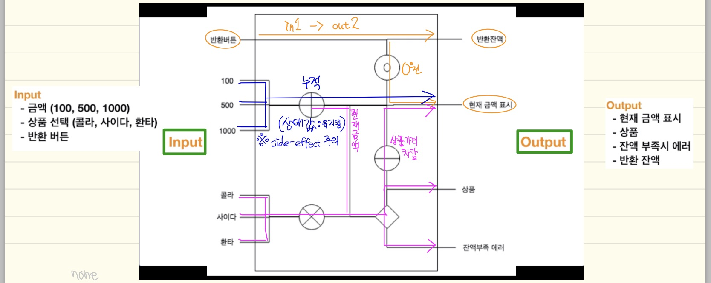

# Swift로 함수형 프로그래밍 시작하기

- 링크: http://programmers.co.kr/learn/courses/4806

## **파트1. 함수형 프로그래밍 소개**  

### **현재의 프로그래밍 패러다임은 "동시성"이라는 관점으로 옮겨지고 있다.**  

### **OOP에 가려서 주목을 받지 못하던 FP(함수형 프로그래밍)이 다시 주목을 받는 이유**  

- 프로그램 외부 효과를 주지 않는 방법으로 동시성 문제를 해결할 수 있기 때문  

### **FP에 대한 오해들**  

- 프로그래밍 기법들 != FP  
  1. Immutable Data
  2. Higher Order Function
  3. Currying
  4. Map
  5. Filter
  6. Reduce
- Side-Effect Free Programming == FP  
- FP가 OOP를 대체할 수 있을까?  
  - OOP와 FP에 대해 잘 이해하고 현재 내가 당면한 문제를 해결하기 위해 적절한 방법을 선택하면 됩니다. 두가지는 필요에 따라 공존할 수 있다.
- FP는 FP전용 언어로만 가능하다?  
  - 함수를 일급 객체로 취급하는 언어라면 더 편할 뿐 기존 언어들에서도 사용가능

## **파트2. [실습] 함수를 다루는 기술들**  

### **2-1 Pure Function**  

- FP에서 이용하는 함수는 '특정 input에 대하여 항상 동일한 output을 반환하는 함수'를 의미하며 '순수 함수'라고 한다.  
  (output을 만드는데 input만 사용한다는 의미이므로, 함수의 외부값을 사용하지 않아서 side-effect(외부 효과)가 없다는 뜻.)  
  - output은 input에 의해서만 결정  
  - 함수의 실행과정에서 외부에 있는 값을 사용하지 않는다.  
  - 외부의 값을 변경하지도 않음  
  - 즉, side-effect가 없음  
- immutable data(변경이 불가능한 데이터) 만을 사용하고 특정 input에 대해 항상 동일한 output을 내면 순수 함수이다.  
- 함수의 파라미터로 받은 값을 사용하더라도 함수 내부에서 랜덤 값을 사용해서 실행할 때마다 다른 결과를 얻게 된다면 순수 함수가 아니다.  

### **2-2 Higher-Order Function : 고차 함수**  

- 함수를 파라미터로 받거나 함수를 리턴하는 함수  

### **2-3 Composition : 합성**  

- 함수의 반환값이 다른 함수의 입력값으로 사용되는 것  
- 당연히 함수가 합성되기 위해서는 함수의 반환 값과 이것을 입력으로 받아들이는 값은 타입이 서로 같아야 합니다.  

### **2-4 Currying**  

- 여러 개의 파라미터를 받는 함수를 하나의 파라미터를 받는 여러 개의 함수로 쪼개는 것.  
- 커링을 왜 해야 하나요?  
- 함수의 합성을 원활하게 하기 위해서
- 합성을 할 때는 output에서 input으로 연결될 때 타입의 갯수가 같아야 되기 때문

### **2-5 Async Result**  

```swift
func f(_ nums: [Int]) -> Int {  
    sleep(1)  
    let sum = nums.reduce(0, +)  
    return sum  
}  
```

- async하게 변경

```swift
func af(_ nums: [Int], _ result: @escaping (Int) -> Void) {
    DispatchQueue.main.async {
        sleep(1)
        let sum = nums.reduce(0, +)
        result(sum)
    }
}
```


## 파트3. [리팩토링/라이브코딩] 총 3개의 프로그램을 non-FP에서 FP로  

### 3-2 Low-High

- 개요
  - Low-High 는 사용자로부터 숫자를 입력받아 랜덤(1~100)으로 생성된 값과 비교하여,
    - 큰 값이 입력되면 High
    - 작은 값이 입력되면 Low
    - 같으면 Correct! 를 출력합니다.
    - Correct 출력 시 시도했던 횟수를 함께 출력합니다.
    - 수행은 Correct가 될 때까지 무한반복됩니다.
    - 숫자가 입력되지 않으면 Wrong 을 출력합니다.

- 함수형 프로그래밍에서는 Side-Effect(외부효과)가 없도록 프로그래밍하기 때문에 global 변수가 없는 것이 특징입니다.  

- 프로그램 전체적으로 유지되는 값도 파라미터를 통해 입력받고 함수 간에 전달되면서 사용됩니다.  

  - ```swift
    import Foundation
    
    enum Result: String {
        case wrong = "Wrong"
        case correct = "Correct!"
        case high = "High"
        case low = "Low"
    }
    
    func generateAnswer(_ min: Int, _ max: Int) -> Int {
        return Int(arc4random()) % (max - min) + min
    }
    
    func inputAndCheck(_ answer: Int) -> () -> Bool {
        return { printResult(evaluateInput(answer)) }
    }
    
    func evaluateInput(_ answer: Int) -> Result {
        guard let inputNumber = Int(readLine() ?? "") else { return .wrong }
        if inputNumber > answer { return .high }
        if inputNumber < answer { return .low }
        return .correct
    }
    
    func printResult(_ r: Result) -> Bool {
        if case .correct = r { return false }
        print(r.rawValue)
        return true
    }
    
    func corrected(_ count: Int) -> Void {
        print("Correct! : \(count)")
    }
    
    func countingLoop(_ needContinue: @escaping () -> Bool, _ finished: (Int) -> Void) {
    
        func counter(_ c: Int) -> Int {
            if !needContinue() { return c }
            return counter(c + 1)
        }
    
        finished(counter(0))
    }
    
    // 카운팅하면서 루프를 도는데 입력을 받고 체크를 합니다.
    // 그 체크 값은 1~100의 랜덤값과 비교를 합니다. 그리고 다 완료되면 corrected 함수 실행.
    countingLoop(inputAndCheck(generateAnswer(1, 100)), corrected)
    ```

- 프로그램이 수행되는 과정대로 프로그래밍하는 것이 아니라 어떠한 동작을 해야하는지 어떠한 결과가 나와야 하는지를 정의하는 프로그래밍 방식을 “선언형 프로그래밍”이라고 합니다.

- 함수형 프로그래밍은 선언형 프로그래밍 형태를 띄고 있습니다. 

- 맨 마지막 한 줄로 어떻게 프로그래밍 되어지는지를 선언형으로 설명하고 있습니다.  

### 3-3 WeatherForecast  

- 동작 구분  
  1. 지역 검색
     - => [Location]  
  2. Location  
     - => woeid (지역ID) 
       - => [Weather]  
  3. Weather  
     - => print  

- 비동기 처리  

  - ```swift
    // completed 함수를 통해서 네트워크 통신으로 얻은 data를 전달
    // data를 얻지 못했다면 completed가 불러지지 않으면서 data가 전달되지 않는다.
    func getData(_ url: URL, _ completed: @escaping (Data) -> ()) {  
    	DispatchQueue.global(qos: .default).async {  
    		if let data = try? Data(contentsOf: url) {  
    			completed(data)  
    		}  
    	}  
    }  
    ```

## 파트4. [프로젝트] FP를 실무에 적용하기 위한 예제 프로젝트  

### 자동판매기 프로젝트 개요  

1. ,상품은 콜라(1000), 사이다(1100), 환타(1200)  
2. 사용가능 지폐는 100, 500, 1000
3. 현재 입력된 금액을 표시
4. 상품이 나오면 상품 금액만큼 현재 금액에서 차감됨
5. 입력된 금액이 상품 가격보다 낮으면 상품이 나오지 않음
6. 반환버튼을 누르면 현재 잔액이 모두 나오게 됨

### FP가 아니더라도 프로그램을 설계하기 위해서는 input과 output을 정의하는 것 부터  

### FP는 함수로 구성된 하나의 커다란 함수가 만들어지는 형태로 프로그램이 구성되어지기 때문에 이 커다란 함수를 블랙박스로 두고 input과 output을 정의한다.  

### 그리고 그 사이의 관계를 분석한다.  



### 구현하기

#### 1. 데이터 정의

- 설계 단계에서 정의된 데이터를 코드로 표현합니다.

  - input

  ```swift
  enum Product: Int {
      case cola = 1000
      case cider = 1100
      case fanta = 1200
      func name() -> String {
          switch self {
          case .cola: return "콜라"
          case .cider: return "사이다"
          case .fanta: return "환타"
          }
      }
  }
  
  enum Input {
      case moneyInput(Int)
      case productSelect(Product)
      case reset
      case none
  }
  ```

  - output

  ```swift
  enum Output {
      case displayMoney(Int)
      case productOut(Product)
      case shortMoneyError
      case change(Int)
  }
  ```

#### 2. 함수 작성

- 설계 단계에서 정의 된 각각의 input과 output을 처리하는 함수를 구현합니다.

  - input 처리

  ```swift
  func consoleInput() -> Input {
      guard let command = readLine() else { return .none }
      switch command {
      case "100": return .moneyInput(100)
      case "500": return .moneyInput(500)
      case "1000": return .moneyInput(1000)
      case "cola": return .productSelect(.cola)
      case "cider": return .productSelect(.cider)
      case "fanta": return .productSelect(.fanta)
      case "reset": return .reset
      default: return .none
      }
  }
  ```

  - output 처리

  ```swift
  func consoleOutput(_ output: Output) -> Void {
      switch output {
      case .displayMoney(let m):
          print("현재 금액은 \(m)원 입니다.")
      case .productOut(let p):
          print("\(p.name())이 나왔습니다.")
      case .shortMoneyError:
          print("잔액이 부족합니다.")
      case .change(let c):
          print("잔액 \(c)원이 나왔습니다.")
      }
  }
  ```

  - 상태값 변경

  ```swift
  func operation(_ inp: @escaping () -> Input, _ out: @escaping (Output) -> Void) -> (State) -> State {
      return { state in
          let input = inp()
  
          switch input {
          case .moneyInput(let m):
              let money = state.money + m
              out(.displayMoney(money))
              return State(money: money)
  
          case .productSelect(let p):
              if state.money < p.rawValue {
                  out(.shortMoneyError)
                  return state
              }
              out(.productOut(p))
              let money = state.money - p.rawValue
              out(.displayMoney(money))
              return State(money: money)
  
          case .reset:
              out(.change(state.money))
              out(.displayMoney(0))
              return State(money: 0)
  
          case .none:
              return state
          }
      }
  }
  ```

#### 3. 함수의 합성

- 설계 시의 관계도에 따라 함수의 input과 output을 합성합니다.

  - 합성 전

  ```swift
  func operation(- state: State) -> State {
      let input = consoleInput()
      switch input {
      case .moneyInput(let m):
          let money = state.money + m
          consoleOutputo(.displayMoney(money))
          return State(money: money)
          
      case .productSelect(let p):
          if state.money < p.rawValue {
          	consoleOutput(.shortMoneyError)
              return state
          }
          consoleOutput(.productOut(p))
          let money = state.money - p.rawValue
          consoleOutput(.displayMoney(money))
          return State(money: money)
          
      case .reset:
          consoleOutput(.change(state.money))
          consoleOutput(.displayMoney(0))
          return State(money: 0)
          
      case .none:
          return state
      }
  }
  ```

  - 합성 후

  ```swift
  // Curring (inp === consoleInput, out === consoleOutput)
  func operation(_ inp: @escaping () -> Input, _ out: @escaping (Output) -> Void) -> (State) -> State { 
      return { state in
          let input = inp()
  
          switch input {
          case .moneyInput(let m):
              let money = state.money + m
              out(.displayMoney(money))
              return State(money: money)
  
          case .productSelect(let p):
              if state.money < p.rawValue {
                  out(.shortMoneyError)
                  return state
              }
              out(.productOut(p))
              let money = state.money - p.rawValue
              out(.displayMoney(money))
              return State(money: money)
  
          case .reset:
              out(.change(state.money))
              out(.displayMoney(0))
              return State(money: 0)
  
          case .none:
              return state
          }
      }
  }
  
  func machineLoop(_ f: @escaping (State) -> State) {
      func loop(_ s: State) {
          loop(f(s))
      }
      loop(State.initial())
  }
  
  machineLoop(operation(consoleInput, consoleOutput))
  ```


