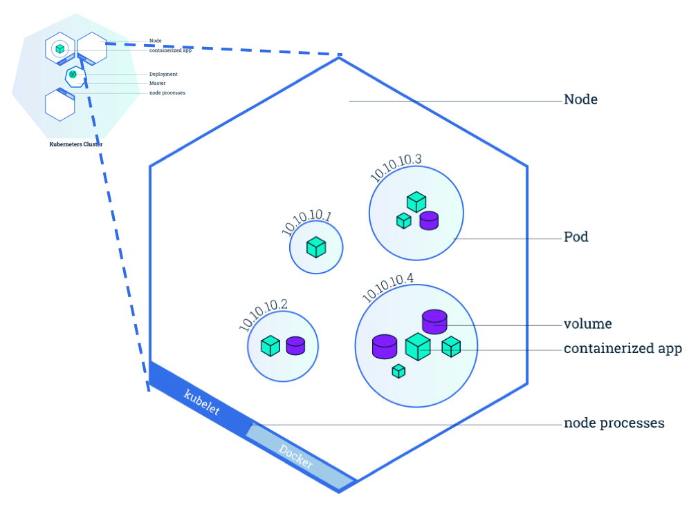

> ### *"<u>iOS 관련 지식</u> 및 <u>AWS 서버</u>에 대한 이해 공부(15일 까지), <u>이젤의 Techstack</u> 확인 및 이해: https://stackshare.io/eazel/eazel"*


##### 목차

- [iOS 관련 지식](#iOS-관련-지식-⬆︎)
- [AWS 서버](#AWS-서버-⬆︎)
  - [EC2 (Elastic Computed Cloud)](#EC2-(Elastic-Computed-Cloud))
  - [EBS (Elastic Block Store)](#EBS-(Elastic-Block-Store)-⬆︎)
  - [S3 (Simple Storage Service)](#S3-(Simple-Storage-Service)-⬆︎)
  - [AutoScaling](#AutoScaling-⬆︎)
  - [Elastic IP](#Elastic-IP-⬆︎)
- [이젤의 Techstack](#이젤의-Techstack-⬆︎)
  - [Application and Data](#Application-and-Data-⬆︎)
    - [React](#React-⬆︎)
    - [Ruby](#Ruby-⬆︎)
    - [C#](#C#-⬆︎)
    - [nginx](#nginx)
    - [Ubuntu](#Ubuntu)
    - [Sass](#Sass)
    - [Rails](#Rails)
    - [TypeScript](#TypeScript)
    - [RxJS](#RxJS)
    - [Docker for AWS](#Docker-for-AWS)
    - [GraphQL Ruby](#GraphQL-Ruby)
  - [Utilities](#Utilities)
    - [SendGrid](#SendGrid)
    - [Let’s Encrypt](#Let's-Encrypt)
    - [OpenCV](#OpenCV)
  - [DevOps](#DevOps)
    - [BitBucket](#BitBucket)
    - [Kubernetes](#Kubernetes)
    - [Vagrant](#Vagrant)
  - [Business Tools](#Business-Tools)
    - [Slack](#Slack)
    - [Trello](#Trello)
    - [Confluence](#Confluence)
    - [JIRA](#JIRA)
    - [MailChimp](#MailChimp)
    - [Figma](#Figma)


# iOS 관련 지식 [⬆︎](#목차)


# AWS 서버 [⬆︎](#목차)

## [EC2 (Elastic Computed Cloud)](#목차)

### 인스턴스 타입  

1. AMI(Amazon Machine Image) 선택  
   - 임대한 컴퓨터의 운영체제 선택  
2. 인스턴스 타입 ==선택==
   - 임대할 컴퓨터의 사양을 선택  

### 가격 정책  

- 온 디맨드 인스턴스  
  - 켜고 끄고 할 수 있는 인스턴스(주문형)  
  - t2.micro 시간당 20원, 월 14,400원  
  - 개발용으로 t2.nano를 사용하면 월 7,200원  
- 예약 인스턴스  
  - 할인권 구매  
- 스팟 인스턴스  
  - 수요와 공급에 따라 스팟 가격이 적용됨  

### 인스턴스 장치 설정  

3. 인스턴스 구성  
   - Shutdown behavior  
     - 인스턴스의 운영체제를 셧다운 할 때, 인스턴스를 ‘stop’ 할 지, ‘terminate’ 할 지 지정 
     - stop  
       - 인스턴스를 지우지 않고 일시로 얼려 놓는다.  
       - 저장 장치에 해당하는 요금만 발생  
     - terminate  
       - 인스턴스의 삭제. 데이터가 사라진다  

4. 스토리지 추가  

### 태그와 보안 그룹  

5. 태그 인스턴스  
   - 태그  
     - 어떤 인스턴스를 만들면 그 인스턴스가 어떤 역할인지 또 누가 관리하는지 등 이러한 정보들을 적어둠  
     - 예  
       - Name => Web Server  
         관리자 => egoing  
         type => real  

6. 보안 그룹 구성  
   - 네트워크를 통해서 누가 이 인스턴스에 접속할 수 있게 할지, 어떤 방식의 접속을 허용할 것인지 등을 지정 (a.k.a 방화벽)  
   - 보안 그룹  
     - 만든 인스턴스에 접속하는 여러가지 방법 중 제한된 방법들만 네트워크를 통해서 이 인스턴스로 접속하는 것을 허용하게 하는 정책  
     - SSH (Secure Shell)  
       - 만들고 있는 인스턴스가 리눅스(유닉스 계열)라고 한다면 그 인스턴스를 물리적 실제 컴퓨터로 제어를 해야 한다. 그런 경우에 리눅스에서 사용하는 원격 제어의 방식  
       - 인스턴스가 리눅스라면 SSH 방식을 허용해 주어야 한다.  
       - Source  
         - Anywhere  
         - My IP  
         - Custom IP  
     - HTTP  
       - 인스턴스를 웹 서버로 사용하고 싶을 때, 웹 브라우저를 통해서 사람들이 이 인스턴스로 접속할 때 사용하는 프로토콜  
       - port  
         - 80  
       - Source  
         - Anywhere  
     - RDP  
       - 리눅스와 달리 윈도우 인스턴스에서 원격제어하는 방식  
       - port  
         - 3389  

### 인스턴스 비밀번호 생성  

- 비밀번호 파일 잘 관수하자.  

### macOS에서 리눅스 인스턴스로 접속  

1. 인스턴스 오른쪽 클릭  
2. connect  
3. ‘A standalone SSH Client’  
4. 터미널 열기  
5. 비밀번호 파일 위치 경로로 이동  
6. ‘chmod 400 aws_password.pem’  
   - 이 파일의 소유자만 이 파일을 읽을 수 있고 소유자가 아닌 사람은 이 파일이 존재하는지도 알 수 없다  
   - -r-------  
7. ‘ssh -i “aws_password.pem” ubuntu@54.238.222.246’  
   - ssh  
     - 리눅스 접속 프로그램(접속방식)  
   - -i  
     - 로그인을 위해 패스워드 파일 전송하여 제출하는 옵션  
   - ubuntu  
     - 접속 ID  
     - ubuntu가 아니면 ec2-user  
   - 54.238.222.246  
     - 접속하려는 인스턴스의 위치를 나타내는 IP  
8. 원격 접속 됨  
9. 접속 끊기  
   - ‘exit’  

### 리눅스에서 웹 서버 사용  

- ‘sudo apt-get install apache2’  
  - apt-get  
    - 명령어를 통해 프로그램을 설치할 수 있게 해주는 일종의 앱스토어  
- (’sudo apt-get update;’)  
  - 업데이트가 필요할 수 있음  
- 접속 시도  
  - Public DNS를 브라우저 주소표시줄에 붙여넣기  

### 터미널 활용

#### EC2 인스턴스 정보를 가져오는 방법​	

~~~
$ aws ec2 describe-instances --instance-ids i-0e7abc17 i-4d7bbd54 --filters "Name=availability-zone, Values=ap-northeast-1c"
~~~

- filters
  - 가져온 EC2 인스턴스 정보 중에서 조건대로 걸러내는 옵션
  - Name
    - 걸러낼 항목
    - availability-zone
    - instance-state-name
    - 등 EC2 인스턴스 정보에서 모든 항목을 설정할 수 있습니다.
  - Values
    - 걸러낼 항목의 값을 배열로 설정
- instance-ids
  - 가져올 EC2 인스턴스의 ID를 배열로 설정

#### EC2 인스턴스를 시작하는 방법

~~~
$ aws ec2 start-instances --instance-ids i-0e7abc17 --no-dry-run
$ aws ec2 start-instances --instance-ids i-0e7abc17 --dry-run
$ aws ec2 reboot-instances --instance-ids i-0e7abc17
$ aws ec2 terminate-instances --instance-ids i-0e7abc17
~~~

- DryRun
  - 테스트 실행 옵션
  - DryRun 옵션을 사용하면 API 호출 결과가 반영되지는 않지만, API 호출 에러는 그대로 표시되므로 디버깅할 때 유용

#### EC2 인스턴스를 정지하는 방법

~~~
$ aws ec2 stop-instances --instance-ids i-0e7abc17 --no-force
$ aws ec2 stop-instances --instance-ids i-0e7abc17 --force
$ aws ec2 stop-instances --instance-ids i-0e7abc17 --no-dry-run
$ aws ec2 stop-instances --instance-ids i-0e7abc17 --dry-run
~~~

- Force
  - 시스템 종료로 정지시키지 않고 강제로 종료시키는 옵션

#### EC2 인스턴스를 생성하는 방법

~~~
$ aws ec2 run-instances --image-id ami-25dd9324 --count 1 --monitoring Enabled=false --iam-instance-profile Name=ExampleEC2Role --instance-type t1.micro --key-name awskeypair --no-dry-run
~~~

- image-id
  - EC2 인스턴스를 생성할 AMI 이미지 ID를 설정
- count
  - 생성할 EC2 인스턴스 갯수 설정
- monitoring
  - 세부 모니터링 옵션
- iam-instance-profile
  - EC2 인스턴스에서 사용할 IAM 역할 이름을 설정
- instance-type
  - 인스턴스 유형을 설정
- key-name
  - EC2 인스턴스 접속에 사용할 키 쌍 이름을 설정

### Ruby 예제

#### 인스턴스 생성

- 다음 예제에서는 태그 `Group` 및 값 `MyGroovyGroup`으로 Amazon EC2 인스턴스 `MyGroovyInstance`를 생성합니다. 인스턴스는 ID `ACCOUNT_ID`의 계정에 대한 머신 이미지 `MACHINE_IMAGE`가 있는 가용 영역 `us-west-2a`, ID `SECURITY_GROUP_ID`의 보안 그룹, ID `SUBNET_ID`의 서브넷에서 생성됩니다. 그러면 인스턴스의 ID 및 퍼블릭 IP 주소가 표시됩니다.

  - 빈 스크립트 값에서 Amazon EC2 인스턴스가 시작될 때 실행된다는 지침을 추가할 수 있습니다.

  ~~~ruby
  require 'aws-sdk'
  require 'base64'
  
  # User code that's executed when the instance starts
  script = ''
  
  encoded_script = Base64.encode64(script)
  
  ec2 = Aws::EC2::Resource.new(region: 'us-west-2')
  
  instance = ec2.create_instances({
    image_id: 'IMAGE_ID',
    min_count: 1,
    max_count: 1,
    key_name: 'MyGroovyKeyPair',
    security_group_ids: ['SECURITY_GROUP_ID'],
    user_data: encoded_script,
    instance_type: 't2.micro',
    placement: {
      availability_zone: 'us-west-2a'
    },
    subnet_id: 'SUBNET_ID',
    iam_instance_profile: {
      arn: 'arn:aws:iam::' + 'ACCOUNT_ID' + ':instance-profile/aws-opsworks-ec2-role'
    }
  })
  
  # Wait for the instance to be created, running, and passed status checks
  ec2.client.wait_until(:instance_status_ok, {instance_ids: [instance[0].id]})
  
  # Name the instance 'MyGroovyInstance' and give it the Group tag 'MyGroovyGroup'
  instance.create_tags({ tags: [{ key: 'Name', value: 'MyGroovyInstance' }, { key: 'Group', value: 'MyGroovyGroup' }]})
  
  puts instance.id
  puts instance.public_ip_address
  ~~~

#### 인스턴스 시작하기

- 다음 예제에서는 `us-west-2` 리전에서 인스턴스 `i-123abc`를 시작합니다.

  ```ruby
  require 'aws-sdk'
  
  ec2 = Aws::EC2::Resource.new(region: 'us-west-2')
        
  i = ec2.instance('i-123abc')
      
  if i.exists?
    case i.state.code
    when 0  # pending
      puts "#{id} is pending, so it will be running in a bit"
    when 16  # started
      puts "#{id} is already started"
    when 48  # terminated
      puts "#{id} is terminated, so you cannot start it"
    else
      i.start
    end
  end
  ```

#### 특정 태그 값이 있는 모든 인스턴스에 대한 정보 획득

- 다음 예제에서는 us-west-2 리전에 태그 Group 및 태그 값 MyGroovyGroup이 있는 Amazon EC2 인스턴스의 ID 및 상태(보류 중, 실행 중, 종료 중, 종료됨, 중지 중 또는 중지됨)를 나열합니다.

  - 태그 이름과 값은 대/소문자를 구분합니다.

  ~~~ruby
  require 'aws-sdk'
  
  ec2 = Aws::EC2::Resource.new(region: 'us-west-2')
  
  # Get all instances with tag key 'Group'
  # and tag value 'MyGroovyGroup':
  ec2.instances({filters: [{name: 'tag:Group', values: ['MyGroovyGroup']}]}).each do |i|
    puts 'ID:    ' + i.id
    puts 'State: ' + i.state.name
  end
  ~~~


## EBS (Elastic Block Store) [⬆︎](#목차)

### 개요

- EC2 인스턴스에 장착하여 사용할 수 있는 가상 저장 장치
- 프리 티어에서 사용가능
  - EBS Storage 30GB, EBS 200만 I/O 무료 사용
- EBS는 EC2에 설치 된 OS에서 그냥 일반적인 하드디스크나 SSD처럼 인식
- Block
  - 블록 장치(Block Device)라고 하여 Unix/Linux 계열 OS에서 일정한 크기(Block) 단위로 읽고 쓰는 저장장치를 부르는 말입니다.

### 기본 개념

- 볼륨(Volume)
  - EBS의 가장 기본적인 형태로서 OS에서 바로 사용 가능한 형태
- 이미지(Image)
  - AMI(Amazon Machine Image)를 줄여서 부르는 말. 
  - OS가 설치된 형태이며 이 AMI로 EC2 인스턴스를 생성합니다.
- 스냅샷(Snapshot)
  - EBS 볼륨의 특정 시점을 그대로 복사해 저장한 파일
  - 이 스냅샷을 사용하여 EBS 볼륨과 AMI를 생성할 수 있습니다.
- IOPS(Input/Output Operation Per Second)
  - 저장 장치의 성능 측정 단위

## S3 (Simple Storage Service) [⬆︎](#목차)

### 개요

- S3는 인터넷 스토리지 서비스로서 용량에 관계없이 파일을 저장할 수 있고 웹(HTTP 프로토콜)에서 파일에 접근할 수 있다.
- 비용이 EC2와 EBS로 구축하는 것보다 훨씬 저렴하다.
- 동적 웹 페이지(ASP, JSP, PHP, Ruby on Rails 등)와 정적 웹페이지가 섞여 있다면 동적 웹페이지만 EC2에서 서비스하고 정적 웹 페이지는 S3를 이용하면 성능도 높일 수 있고 비용도 절감할 수 있다.
- 요즘 흔히 보는 웹하드 서비스와 비슷하지만 다른 점이 있다
  - 파일 업/다운로드를 모두 HTTP 프로토콜이 처리한다.

### 기본 개념

- 객체(Object)
  - S3에 데이터가 저장되는 최소단위
  - 파일과 메타데이터로 구성됨
  - 기본적으로 키가 객체의 이름, 값이 객체의 데이터
  - 객체 하나의 크기는 1byte~5TB
  - 메타데이터는 HTTP Content-type 형식(MIME)이다.
    - 파일의 확장자에 따라 자동으로 설정되며 임의로 설정할 수도 있다.

- 버킷(Bucket) 
  - S3에서 생성할 수 있는 최상위 디렉터리
  - 버킷은 리전 별로 생성해야 한다.
  - 버킷 안에 객체가 저장된다.
  - 디렉터리 생성 가능
  - 저장 가능한 객체의 수 무한, 가능 용량 무한, 접속 제어 및 권한 관리 가능
  - `http://버킷명.s3.amazonaws.com/객체파일명` 으로 접근 가능  
  - 요금
    - HTTP 요청 개수로 책정

### 터미널 활용

#### S3에 파일을 올리는 방법

~~~
$ aws s3api put-object --bucket 버킷명 --key 객체파일명 --acl public-read --body ./hello.jpg --content-type "image/jpeg" --metadata "someKey=Hello Meatdata" --server-side-encryption AES256 --storage-class STANDARD
~~~

- bucket
  - 버킷명
- key
  - 객체 이름
- acl
  - 접근 권한
  - private
  - public-read
  - public-read-write
  - authenticated-read
  - bucket-owner-read
  - bucket-owner-full-control
- body
  - 객체의 데이터
  - 문자열 형식, 버퍼 형식 사용가능
- content-type
  - MIME 타입
  - 파일에서 확장자가 없을 때는 반드시 MIME 타입을 설정
- metadata
- server-side-encryption
  - 서버에 저장될 때의 암호화 방식.
  - AES256 사용가능
  - 이 옵션을 삭제하면 암호화를 하지 않고 저장
- storage-class
  - 스토리지 옵션
  - STANDARD
  - REDUCE_REDUNDANCY

#### S3 버킷에서 파일을 받는 방법

~~~
$ aws s3api get-object --bucket 버킷명 --key 객체파일명
~~~

### Ruby 예제

#### SDK 구성

- 이 예제의 경우 Amazon S3용 AWS SDK for Ruby에서 제공하는 클래스와 메서드를 사용하고 JSON 형식 데이터로 작업할 수 있도록 require 문을 추가하십시오. 

- 그리고 나서 버킷을 생성하려는 AWS 리전에서 Aws::S3::Client 객체를 생성하고 지정된 AWS 프로필을 생성합니다. 

- 이 코드는 us-east-1 리전에 Aws::S3::Client 객체를 생성합니다. 

- 이 예제에 사용된 두 개의 버킷에 대해 추가 변수도 선언됩니다.

  ~~~ruby
  require 'aws-sdk'
  require 'json'
  
  profile_name = 'david'
  region = "us-east-1"
  bucket = 'doc-sample-bucket'
  my_bucket = 'david-cloud'
  
  # S3
  
  # Configure SDK
  s3 = Aws::S3::Client.new(profile: profile_name, region: region)
  ~~~

#### 버킷 목록 가져오기

- list_buckets 메서드를 호출합니다. 

- 이렇게 하면 버킷 목록을 나타내는 Aws::S3::Types::ListBucketsOutput 클래스의 인스턴스가 반환됩니다. 

- 그런 다음 ListBucketsOutput 클래스의 buckets 속성을 사용하여 각 버킷의 이름에 대한 name 같은 버킷의 속성에 액세스합니다.

  ~~~ruby
  resp = s3.list_buckets
  resp.buckets.each do |bucket|
    puts bucket.name
  end
  ~~~

#### 버킷 만들기

- create_bucket 메서드를 호출해 버킷의 이름을 지정하십시오.

  - 버킷 이름은 AWS 계정만이 아니라 Amazon S3에서 고유해야 합니다.

  ~~~ruby
  s3.create_bucket(bucket: bucket)
  ~~~

#### 버킷에 객체(파일) 업로드

- put_object 메서드를 호출해 버킷의 이름과 생성할 파일의 이름 같은 설정을 지정하십시오. 

- 파일의 내용에 대해 Ruby File 클래스의 인스턴스 또는 이 예제에서 파일의 데이터를 나타내는 문자열을 지정할 수 있습니다.

- 파일이 성공적으로 업로드되었는지 확인하려면 list_objects_v2 메서드를 호출하십시오. 

- 이렇게 하면 버킷의 객체를 나타내는 Aws::S3::Types::ListObjectsV2Output 클래스의 인스턴스가 반환됩니다. 

- 그런 다음 ListObjectsV2Output 클래스의 contents 메서드를 사용하여 각 버킷의 이름에 대한 key 같은 객체의 속성에 액세스합니다.

  ~~~ruby
  s3.put_object(bucket: bucket, key: "file1", body: "My first s3 object")
  
  # Check the file exists
  resp = s3.list_objects_v2(bucket: bucket)
  resp.contents.each do |obj|
    puts obj.key
  end
  ~~~

#### 버킷 간 파일 복사

- copy_object 메서드를 호출해 객체를 수신할 대상 버킷의 이름(bucket), 복사할 원본 버킷 및 객체의 이름(copy_source), 대상 버킷에 복사되는 새 객체의 이름(key)을 지정하십시오.

- 이 예제에서 복사할 객체를 포함하는 버킷의 이름은 #{my_bucket}으로, david-cloud라는 이름의 버킷입니다. 복사 작업 후에 david-cloud 버킷의 test_file 이름이 doc-sample-bucket 버킷의 file2로 바뀌고, david-cloud 버킷의 test_file1 이름이 doc-sample-bucket 버킷의 file3으로 바뀝니다.

  ~~~ruby
  s3.copy_object(bucket: bucket,
                 copy_source: "#{my_bucket}/test_file",
                 key: 'file2')
  s3.copy_object(bucket: bucket,
                 copy_source: "#{my_bucket}/test_file1",
                 key: 'file3')
  ~~~

#### 버킷에서 파일 삭제

- delete_objects 메서드를 호출하십시오. 

- delete 인수의 경우 Aws::S3::Types::Delete 유형의 인스턴스를 사용해 삭제할 객체를 표현하십시오. 

- 이 예제에서 objects는 삭제할 두 개의 파일을 나타냅니다.

- 파일이 성공적으로 삭제되었는지 확인하려면 전과 같이 list_objects_v2 메서드를 호출하십시오. 

- 이번에는 클래스의 contents 메서드를 사용할 때 삭제된 파일 이름(여기서 key로 표현됨)이 표시되어서는 안 됩니다.

  ~~~ruby
  s3.delete_objects(
    bucket: 'doc-sample-bucket',
    delete: {
      objects: [
        {
          key: 'file2'
        },
        {
          key: 'file3'
        }
      ]
    }
  )
  
  # Verify objects now have been deleted
  resp = s3.list_objects_v2(bucket: bucket)
  resp.contents.each do |obj|
    puts obj.key
  end
  ~~~

## AutoScaling [⬆︎](#목차)

- 트래픽이 늘어나면 자동으로 EC2 인스턴스를 생성해 서비스를 확장하는 기능
- 컴퓨터(인스턴스)를 자동으로 생성해서 바로 서비스를 시작하게 하고 더 이상 인스턴스가 필요없어지면 자동으로 삭제해서 과금이 발생하지 않도록 한다. 
- 보통 Auto Scaling은 ELB(Elastic Load Balancing)와 함께 사용
  - Auto Scaling은 생성한 EC2 인스턴스를 ELB 로드 밸런서에 연결하고, ELB 로드 밸런서는 새로 생성된 EC2 인스턴스에 트래픽을 분산합니다.

## Elastic IP [⬆︎](#목차)

### 개요

- 고정된 공인 IP 제공
- 유동 IP
  - EC2 인스턴스를 생성하면 기본적으로 공인 IP가 부여됩니다
  - 하지만 이 IP주소는 EC2 인스턴스가 실행되고 있는 동안에만 유효하며 EC2 인스턴스가 중단되면 IP주소는 반납됩니다
  - 따라서, EC2 인스턴스를 다시 실행하면 이 공인 IP는 바뀔 수 있습니다
  - 주의할 점은 Elastic IP를 할당받고, EC2 인스턴스에 연결해 사용하지 않으면 요금이 부과됩니다
  - Elastic IP는 DNS 서버에서 도메인과 IP 주소를 연결해야 할 때, 또는 IP 주소가 바뀌지 않고 계속 유지해야 할 때 사용


------

# 이젤의 Techstack [⬆︎](#목차)


# Application and Data [⬆︎](#목차)

## React [⬆︎](#목차)

### 개요

- React는 페이스북에서 개발한 유저인터페이스 라이브러리로서 개발자로 하여금 재사용 가능한 UI를 생성 할 수 있게 해줍니다. 
- 이벤트 요청 시 서버에서 코드를 받아 다시 렌더링해야 되는 문제를 해결하기 위해 만들어졌습니다.
- UI 컴포넌트를 만드는 일만 하며 캡슐화를 잘 시켜줘서 재사용 성이 높습니다.
- 이 라이브러리는 현재 페이스북, 인스타그램, 야후, 넷플릭스를 포함한 많은 큰 서비스에서 사용되고 있습니다.
- 이 라이브러리는 Virtual DOM 이라는 개념을 사용하여 상태의 변함에 따라 선택적으로 유저인터페이스를 렌더링합니다.
- 따라서, 최소한의 DOM 처리로 컴포넌트들을 업데이트 할 수 있게 해줍니다.

### Flux 아키텍처

- MVC는 확장이 어렵고 거대한 시스템에 어울리지 않는다고 페이스북은 결론을 내렸습니다.

- 모델(Model)과 뷰(View)의 수가 커지고 데이터의 흐름이 양방향으로 이루어질 수록 복잡도는 더욱 증가하고 디버깅 및 코드를 이해하기 어려워지므로 MVC는 작은 앱에 어울린다는 것이죠.

- 하지만 "좀더 예측 가능하도록 코드 구조화"에 대한 목표로 "데이터 흐름이 단방향인 시스템 아키텍처" Flux를 제안합니다.

  

- Store

  - APP의 모든 데이터를 저장하며 MVC의 Model 역할입니다.
- Dispatcher

  - 모든 데이터를 관리하는 Controller 역할이며 Action이 시작될 때 어떻게 Store가 업데이트되어야 하는지 결정합니다.
- View

  - Store가 변경된 경우같이 변경됩니다.
- 단방향

  - 데이터는 단방향으로 흐르고 데이터 계층이 자기가 영향을 미치는 View 업데이트 완료 후 다음 작업을 진행합니다.

### Virtual DOM 은 어떻게 작동하는가?

#### DOM

- Document Object Model
- 객체를 통하여 구조화된 문서를 표현하는 방법으로, XML 혹은 HTML로 작성
- 웹 브라우저는 이 DOM을 활용하여 객체에 Javascript와 CSS를 적용
-  DOM은 트리 형태로 되어있어서, 특정 node를 찾을 수도 있고 수정 할 수도 있고 제거하거나 원하는 곳에 삽입 할 수도 있다.
- DOM의 문제점
  - 동적 UI에 최적화되어 있지 않다.
  - 자바스크립트나 jQuery를 사용하여 동적인 변화를 줄 수 있지만, 큰 규모의 웹 앱에는 수많은 요소들이 있으므로 이렇게 규모가 큰 웹 앱에서 DOM에 직접 접근하여 변화를 주도 보면 성능상의 이슈가 조금씩 생기고 속도가 느려진다.
  - 그 이유는 DOM 때문이 아니다. DOM은 매우 빠르지만 DOM의 변화가 일어날 때, 브라우저가 CSS를 다시 연산하고, 레이아웃을 구성하고 웹페이지를 repaint하기 때문에 느려지는 것.
  - 해결법
    - DOM 작업을 가상화하여 미리 처리한 다음에 한꺼번에 적용한다.

##### Virtual DOM

- 실제 DOM에 접근하여 조작하는 대신에, 이를 추상화 시킨 Javascript 객체를 구성하여 사용
- 이는 마치 실제 DOM의 가벼운 사본과 비슷함.
- Virtual DOM에는 `ReactElement`, `ReactElement Factory`, `ReactNode`, `ReactComponent` 그리고 `ReactComponent Class`가 있다.
- React에서 데이터가 변하여 브라우저 상의 실제 DOM을 업데이트 하는 3 단계
  1. 데이터가 업데이트되면, 전체 UI를 Virtual DOM에 리렌더링 한다.
  2. 이전 Virtual DOM에 있던 내용과 현재의 내용을 비교한다.
     - 이것은 가상 DOM(Virtual DOM)에 DOM Tree와 같은 전체 구조체를 가지고 있고 변경이 생기면 구조체를 비교(Diff)하여 최소한의 요소만 DOM에 적용합니다.
  3. 바뀐 부분만 실제 DOM에 적용.
     - 데이터가 변할 때 바뀐 부분만을 업데이트하여 "새로 고침" 하지 않아도 변경된 내용 확인이 가능합니다. 
     - 그래서 React를 적용하면 성능 향상을 볼 수 있으며 React의 큰 특징입니다.
  4. 결국, 컴포넌트가 업데이트 될 때, 레이아웃 계산이 한 번 만 이루어 진다.
- 오해
  - Virtual DOM을 사용한다고 해서, 사용하지 않았을 때에 비해 무조건 빠른 것은 아니다.
  - 지속해서 데이터가 변화하는 대규모 애플리케이션 구축을 위해 React를 만들었다 (React 매뉴얼 중)
  - React와 Virtual DOM은 업데이트 처리에 대한 간결함을 제공
  - UI를 업데이트하는 과정에서 생기는 복잡함을 모두 해소해주고, 업데이트에 더욱 쉽게 접근할 수 있게 해준다.

### 특징

#### Virtual DOM을 사용

#### JSX

- 자바스크립트는 강력한 언어라는 전제로 템플릿을 사용하지 않습니다.
- 템플릿을 사용하지 않아 뷰 로직과 뷰 문법을 통합하여 확장 및 유지 보수가 쉬워졌습니다.
- 템플릿이라고 오해할 수 있는 JSX를 원하면 사용할 수 있습니다.
- JSX(JavaScript XML)는 페이스북에서 스펙을 정의한 XML과 비슷한 자바스크립트 확장 문법입니다.
- 자바스크립트에서 HTML과 자바스크립트 변수 및 속성 값을을 사용 할수 있게 해주며 `*.jsx`파일은 `Webpack`, `Browserify`로 자바스크립트로 컴파일 후 `*.js` 변환되어 사용하며 테스트 코드는 `Bable`로 별도의 컴파일 없이 사용할 수 있습니다. 
- 그리고 이 툴 들이 ECMAScript6,7 지원을 하기 때문에 JSX를 사용시에 ECMAScript6,7도 같이 사용을 많이 합니다.

#### Components

- React는 모두 Component에 대한 것이므로 React 개발을 할 때에는 모든 것을 Component로서 생각해야 한다.

#### 데이터가 양방향으로 흐르지 않는다.

- 양방향
  - 상위 컴포넌트에서 하위 컴포넌트로 혹은 하위 컴포넌트에서 상위 컴포넌트로
- 단방향
  - 상위 컴포넌트에서 하위 컴포넌트로
- 양방향 데이터 바인딩을 하게 되면 개발 비용은 일시적으로 적다고 느낄 수 있지만, 장기적으로 데이터 흐름을 이해하기 어려워 개발 비용이 증가합니다.
- 그래서 React는 위에서 아래로만 데이터가 흐르고, 아래에서 위로 올라갈 수는 없습니다.

#### 클라이언트에서만 실행되는 것은 아니다. (Server Side Rendering)

- 클라이언트에서만 렌더링을 하게 되면 `HTML + Javascript + Data + View` 순으로 진행하는 시간 소요로 초기 구동 속도가 느리다. 
- React가 빠르다는 건 초기 구동 이후다.
- 또한, 자바스크립트를 실행하지 못하는 검색 엔진 봇들은 처음 렌더링 된 빈 HTML만 수집하기 때문에 콘텐츠가 없다고 판단하므로 검색 엔진 최적화(SEO)에 취약하다.
- 이런 단점을 해결하기 위해 서버 측에서 렌더링을 지원한다.

### 장점

- Virtual DOM을 사용한 어플리케이션의 성능 향상
- 클라이언트에서도 렌더링 될 수 있고, 서버측에서도 렌더링 될 수 있음 (이를 통해 브라우저 측의 초기 렌더링 딜레이를 줄이고,SEO 호환도 가능해진다.)
- Component의 가독성이 매우 높고 간단하여 쉬운 유지보수가 가능.
- Framework가 아닌 Library라서 다른 프레임워크들과 사용이 가능합니다.
  - React에선 UI만 신경쓰고, 빠져있는 부분은 본인이 좋아하는 라이브러리를 사용하여 stack을 본인의 입맛대로 설정 할 수 있음

### 제한

- 앱의 View 레이어만 다루므로 이 외의 부분은 다른 기술을 사용해야 한다.
  - 예를 들어 Ajax, Router 등의 기능은 직접 구현하거나 다른 모듈을 설치하여 사용.
- React 버전 v15부터 IE8 이하 버전을 지원하지 않는다.

### 번들링(bundling)

webpack 이라는 도구를 사용하여 마치 Node.js 에서 require 하는것과 같이 모듈을 불러올 수 있게 하는 것 입니다. webpack 은 이렇게 import(혹은 require) 한 모듈들을 불러와서 한 파일로 합칩니다.

### 간단한 예제

- 출처: <http://yumere.tistory.com/78> [Yumere]

#### Example 1

```html
<!DOCTYPE html> 
<html lang="en"> 
    <head> 
        <meta charset="UTF-8"> 
        <title>Document</title> 
        <script src="https://cdnjs.cloudflare.com/ajax/libs/react/0.14.0/react.js"></script> 
        <script src="https://cdnjs.cloudflare.com/ajax/libs/react/0.14.0/react-dom.js"></script> 
        <script src="https://cdnjs.cloudflare.com/ajax/libs/babel-core/5.8.23/browser.min.js"></script> 
        <script src="https://cdnjs.cloudflare.com/ajax/libs/jquery/2.1.1/jquery.min.js"></script> 
    </head> 
    <body> 
        <div id="content"></div> 
        <script type="text/babel"> 
        var CommentBox = React.createClass({
            render: function() { 
                return ( 
                    <div className="commentBox"> 
                        Hello, world! I am a CommentBox. 
                    </div> 
                ); 
            } 
        }); 
        ReactDOM.render( 
        	<CommentBox />, 
            document.getElementById('content') 
        ); 
        </script> 
    </body> 
</html>
```


1. `<head></head>` 태그 내에 위의 JS 파일들은 전부 include 해야 한다. 

   - 여기서는 jsx 파일을 컴파일 하지 않기 때문에 `babel`은 무조건 include 해야 한다.

2. React js로 만든 DOM을 생성할 div를 하나 만든다. 

   - 물론 div가 아닌 body에다가 rendering 할 수도 있다.

3. 다음의 코드를 이용해 하나의 `Component`를 만든다.

   ~~~html
   var CommentBox = React.createClass({})
   ~~~

   - 이 때, Component 이름은 무조건 대문자로 시작하는 Camel case로 하여야 한다.

#### Example 2

- 이번 예제는, 여러개의 component를 이용해 DOM을 구성하고 상위 component에서 데이터를 받아 `this.props.*`를 통해 접근하여 표시할 수 있는 예제이다. 
- 아래 코드와 같이 React JS에서 **Data Flow**는 상위 component에서 하위 component로 진행된다.

```html
<!DOCTYPE html>
<html lang="en">
<head>
  <meta charset="UTF-8">

  <title>Document</title>

  <script src="https://cdnjs.cloudflare.com/ajax/libs/react/0.14.0/react.js"></script>
  <script src="https://cdnjs.cloudflare.com/ajax/libs/react/0.14.0/react-dom.js"></script>
  <script src="https://cdnjs.cloudflare.com/ajax/libs/babel-core/5.8.23/browser.min.js"></script>
  <script src="https://cdnjs.cloudflare.com/ajax/libs/jquery/2.1.1/jquery.min.js"></script>
</head>
<body>
  <style>
  #content{
    border: 1px solid red;
    padding: 5px;
    margin: 5px;

    max-width: 500px;
  }

  .commentBox{
    border: 1px solid black;
    padding 1px;
    margin: 5px;
  }

  .commentList{
    border: 1px solid blue;
    padding: 5px;
    margin: 5px;
  }

  .commentForm{
    boder: 1px  solid red;
    padding: 5px;
    margin: 5px;
  }

  .comment{
    border: 1px solid black;
    padding: 5px;
    margin: 5px;
  }
  </style>

  <div id="content"></div>

  <script type="text/babel">
  var data = [
    {author: "Pete Hunt", text: "This is one comment"},
    {author: "Jordan Walke", text: "This is *another* comment"}
  ];

  var CommentBox = React.createClass({
    render: function() {
      return (
        <div className="commentBox">
          <h1>Comments</h1>
          <CommentList {...this.props} />
          <CommentForm />
        </div>
      );
    }
  });

  var CommentList = React.createClass({
    render: function() {
      var comments = this.props.data.map(function(comment, index){
        return <Comment author={comment.author} key={index}>{comment.text}</Comment>
      }.bind(this));

      return (
        <div className="commentList">
          {comments}
        </div>
      );
    }
  });

var CommentForm = React.createClass({
  render: function() {
    return (
      <div className="commentForm">
        <form className="commentForm">
          <input type="text" placeholder="Your name" ref="author"/>
          <input type="text" placeholder="Say something..." ref="text"/>
          <input type="submit" value="Post" />
        </form>
      </div>
    );
  }
});

  var Comment = React.createClass({
    render: function() {
      return (
        <div className="comment">
          <h2 className="commentAuthor">
            {this.props.author}
          </h2>
          {this.props.children}
        </div>
      );
    }
  });

  ReactDOM.render(
    <CommentBox data={data}/>,
    document.getElementById('content')
  );
  </script>

</body>
</html>
```

- 결과

  

  - 위의 코드를 보면 `...this.props`를 사용하고 있는데, 이는 상위 component에서 받은 props들을 그대로 하위 component로 넘기겠다는 의미이다. 

  - 전부 전달 하는 것 외에도 몇개를 현재 component에서 사용하고 나머지를 넘기는 것도 가능하다.

    ```html
    ... 
    var {checked, ...other} = this.props; 
    return( 
    <div {...other} className={test}></div> 
    ); 
    ...
    ```

#### Example 3

- `this.state`를 이용해 데이터를 변경하고 변경된 component만 `re-rendering`하는 방법을 알 수 있는 예제이다.

  ```html
  <!DOCTYPE html>
  <html lang="en">
  <head>
    <meta charset="UTF-8">
  
    <title>Document</title>
  
    <script src="https://cdnjs.cloudflare.com/ajax/libs/react/0.14.0/react.js"></script>
    <script src="https://cdnjs.cloudflare.com/ajax/libs/react/0.14.0/react-dom.js"></script>
    <script src="https://cdnjs.cloudflare.com/ajax/libs/babel-core/5.8.23/browser.min.js"></script>
    <script src="https://cdnjs.cloudflare.com/ajax/libs/jquery/2.1.1/jquery.min.js"></script>
  </head>
  <body>
    <style>
    #content{
      border: 1px solid red;
      padding: 5px;
      margin: 5px;
  
      max-width: 500px;
    }
  
    .commentBox{
      border: 1px solid black;
      padding 1px;
      margin: 5px;
    }
  
    .commentList{
      border: 1px solid blue;
      padding: 5px;
      margin: 5px;
    }
  
    .commentForm{
      boder: 1px  solid red;
      padding: 5px;
      margin: 5px;
    }
  
    .comment{
      border: 1px solid black;
      padding: 5px;
      margin: 5px;
    }
    </style>
  
    <div id="content"></div>
  
    <script type="text/babel">
    var data = [
      {author: "Pete Hunt", text: "This is one comment"},
      {author: "Jordan Walke", text: "This is *another* comment"}
    ];
  
    var CommentBox = React.createClass({
      getInitialState: function(){
        return {data: this.props.data};
      },
  
      dataChange: function(author, text){
        var tmpData = this.state.data;
        tmpData.push({
          author: author,
          text: text
        });
  
        this.setState({data:tmpData});
  
  
      },
  
      render: function() {
  
        return (
          <div className="commentBox">
            <h1>Comments</h1>
            <CommentList data={this.state.data} />
            <CommentForm formHandler={this.dataChange} />
          </div>
        );
      }
    });
  
    var CommentList = React.createClass({
      render: function() {
        var comments = this.props.data.map(function(comment, index){
          return <Comment author={comment.author} key={index}>{comment.text}</Comment>
        }.bind(this));
  
        return (
          <div className="commentList">
            {comments}
          </div>
        );
      }
    });
  
  var CommentForm = React.createClass({
    formOnChange: function(e){
      e.preventDefault();
      var author = this.refs.author.value;
      var text = this.refs.text.value;
  
      if(author!="" && text!=""){
        this.props.formHandler(author, text);
        this.refs.author.value = '';
        this.refs.text.value = '';
      }
  
      else{
        alert("Fill author and text");
      }
  
    },
    render: function() {
      return (
        <div className="commentForm">
          <form className="commentForm" onSubmit={this.formOnChange}>
            <input type="text" placeholder="Your name" ref="author"/>
            <input type="text" placeholder="Say something..." ref="text"/>
            <input type="submit" value="Post" />
          </form>
        </div>
      );
    }
  });
  
    var Comment = React.createClass({
  
      render: function() {
        return (
          <div className="comment">
            <h2 className="commentAuthor">
              {this.props.author}
            </h2>
            {this.props.children}
          </div>
        );
      }
    });
  
    ReactDOM.render(
      <CommentBox data={data}/>,
      document.getElementById('content')
    );
    </script>
  
  </body>
  </html>
  ```

- 결과

  

  - 위의 코드를 실행해 보면, form 태그에 입력하는 그대로 브라우저에 표시되는 것을 볼 수 있다. 이처럼 `this.state`를 이용하면 데이터를 변경하고 실시간으로 이를 표시할 수 있다.

  - 위 코드를 자세히 보면, `CommentBox` component 내부에 `CommentList`, `CommentForm` component가 존재한다. 

  - 그리고 이 예제에서 하려고 하는 일은 `CommentForm` component에서 데이터를 수정하면 그 변화가 `CommentList`에 나타날 수 있게 하는 것이다.

  - 그러기 위해선 `CommentList`와 `CommentForm`의 데이터를 컨트롤 할 수 있는 `CommentBox`에 **state**를 두어야 한다. 먼저 `getInitialState` **Lifecycle Method**를 이용해 초기 state를 초기화 한다.

    ```html
    var CommentBox = React.createClass({ 
    	getInitialState: function(){ 
    		return {data: this.props.data}; 
    	},
    ```

  - 이 후 data state를 변경할 `dataChange`함수를 만든다. 

  - author와 text를 받아오면 기존 state에 데이터를 추가하고 `this.setState()` 함수를 호출하는 것을 볼 수 있다. 

  - React JS에서 this.state를 직접적으로 변경하면 데이터는 변경 되나 rendering이 되지 않아 데이터 변화를 표시할 수 없다. 

  - 하지만 `this.setState()` 함수를 이용하면 state 값을 변경하고 변경된 component를 **re-rendering**한다.

    ```html
    dataChange: function(author, text){ 
    	var tmpData = this.state.data; 
    	tmpData.push({ 
    		author: author, 
    		text: text 
    	}); 
    	
    	this.setState({data:tmpData}); 
    },
    ```

  - 하지만 이 `dataChange` 함수는 현재 component인 `CommentBox`에서 사용할 함수가 아닌 `CommentForm` component에서 사용할 함수이다. 그러므로 이 함수를 `CommentForm` component에 **props**로 넘겨준다.

    ```html
    var CommentBox = React.createClass({ 
    ... 
    ... 
    	render: function() { 
    		return ( 
    			<div className="commentBox"> 
                    <h1>Comments</h1> 
                    <CommentList data={this.state.data} /> 
                    <CommentForm formHandler={this.dataChange} /> 
    			</div> 
    		); 
    	} 
    });
    ```

  - 이제 `CommentForm`에서는 form submit 이벤트가 발생하면 input 태그의 값을 가져와 `this.props.formHandler` 함수를 사용할 함수를 만든다.

    ```html
    var CommentForm = React.createClass({ 
    	formOnChange: function(e){ 
    		e.preventDefault(); 
    		var author = this.refs.author.value; 
    		var text = this.refs.text.value; 
    		if(author!="" && text!=""){ 
    			this.props.formHandler(author, text); 
    			this.refs.author.value = ''; 
    			this.refs.text.value = ''; 
    		} else{ 
    			alert("Fill author and text"); 
    		} 
    	}, 
    	... 
    	<form className="commentForm" onSubmit={this.formOnChange}> 
        	<input type="text" placeholder="Your name" ref="author"/> 
        	<input type="text" placeholder="Say something..." ref="text"/> 
    	</form> 
    	... 
    }); 
    ```

  - 일반 HTML에서 처럼 `onSubmit` 이벤트를 사용할 수 있으므로 만든 함수를 binding한다.

  - form이 submit이 되면, input 태그에 붙어있는 `ref` 값을 이용해 DOM을 선택하고 값을 가져온다. 

  - 이 후 `CommentBox`에서 만든 함수 `dataChange`를 호출하기 위해 `this.props.formHandler` 함수를 호출한다.

  - 함수가 호출되면 `this.setState` 함수에 의해 state에 변화가 일어나고 React에서는 그 변화를 감지하여 변화된 DOM만 **re-rendering**한다.

#### 요약

- React JS 라이브러리를 이용해 Web 개발을 해 보니 정말 편리하다는 느낌을 받았다. 
- 위에 서술했던대로 Front를 전부 JS로 작성하니 코드를 난잡하지 않게 할 수 있었고, 상위 component에서 하위 component 방향으로 **prop**와 **state**를 이용한 data-flow 방식도 정말 재밌었다. 
- 특히 state를 변경함으로써 해당 state 값을 사용하는 component만 **re-rendering** 하는 방식이 마음에 든다. 
- 또한 이 글에 나오진 않지만 **Mount**라는 개념과 `componentDidMount`, `ComponentWillMount` 등과 같은 **Lifecycle Method**도 흥미롭다.

## Ruby [⬆︎](#목차)

- 루비는 인터프리터 형식으로 실행되는 고기능 스크립트 언어이자 뛰어난 객체 지향적 언어이다.

### 모든 것은 객체

- 마츠모토 유키히로가 개발한 동적 객체 지향 스크립트 프로그래밍 언어이다. 루비는 순수 객체 지향 언어라, 정수나 문자열 등을 포함한 데이터 형식 등 모든 것이 객체이다.
- 루비에서는 모든 것이 객체입니다. 따라서 루비에서 모든 것은 자신만의 속성과 액션을 갖습니다. 객체지향 프로그래밍에서 이런 속성을 *인스턴스 변수*라고 하고, 액션을 *메서드*라고 합니다.
- 루비는 모든 형태의 것에 메서드와 인스턴스 변수를 부여합니다. 이는 모든 곳에서 일관되게 적용되므로 루비 사용법을 쉽게 해줍니다.

### 루비의 유연함

- 개발자가 루비의 어떤 부분이든 자유롭게 바꿀 수 있기 때문에 매우 유연한 언어라고 할 수 있습니다. 
- 원한다면 루비 코어 부분도 제거하고 재정의할 수 있습니다. 
- 이미 존재하는 코드에 무엇인가를 덧붙일 수도 있습니다. 
- 루비는 기본적으로 개발자의 사고를 제한하지 않습니다.

### 루비의 표현력을 풍부하게 해주는 블록

- 개발자는 어떤 메서드에든 클로저를 추가함으로써 메서드의 동작을 기술할 수 있습니다.

### 루비와 믹스인

- 다른 객체지향 언어와 달리 루비는 **의도적으로** 단일 상속만을 제공한다.

- 대신 루비에는 모듈 개념(Obj-C의 카테고리라 불리는)이 있다.

- 모듈은 메서드의 컬렉션이다.

- 클래스에 모듈을 믹스인 할 수 있는데, 그렇게 하면 유용한 메서드를 손쉽게 얻을 수 있다.

- 예를 들어 `each` 메서드를 구현하고 있는 클래스는 어떤 것이든 `Enumerable` 모듈을 믹스인 하기만 하면, `each` 를 루프에 이용해 많은 함수들이 추가됩니다.

  ```ruby
  class MyArray
  	include Enumerable
  end
  ```

### 루비 코드의 외향

- `var` 지역변수
- `@var` 인스턴스 변수
- `$var` 전역변수

### 고급 기능

- 루비에는 자바, 파이썬처럼 예외 처리 기능이 있어서 에러 처리를 간편하게 할 수 있습니다.
- 루비는 모든 객체를 대상으로 마크-스윕 가비지 컬렉터를 제공합니다. 확장 라이브러리에서 레퍼런스 카운트를 관리할 필요는 없습니다. 마츠는 이를 “건강을 위한” 기능이라고 표현했습니다.
- C 에서 루비를 사용하기 위한 간결한 API를 제공하기 때문에, 펄이나 파이썬보다 쉽게 C 확장기능을 만들 수 있습니다. 여기에는 스크립팅을 위해 루비를 임베딩하는 것도 포함됩니다. 물론, SWIG 인터페이스도 제공됩니다.
- OS가 지원한다면 확장 기능을 동적으로 로드할 수 있습니다.
- 루비는 운영체제에 의존하지 않는 스레딩 기능을 제공합니다. 그리고 이는 루비가 동작하는 모든 플랫폼에 적용되어서 스레드를 지원하지 않는 MS-DOS에서도 다중 스레드 프로그램을 작성할 수 있습니다.
- 루비는 이식성이 매우 높습니다. 대부분 GNU Linux에서 개발되었지만 대부분의 UNIX, macOS, Windows, DOS, BeOS, OS/2 등에서 동작합니다.

### 루비의 다른 구현체들

- JRuby
  - JVM(자바 가상 기기) 위에서 구동되는 루비입니다. 
  - JVM의 최적화 JIT 컴파일러, 가비지 컬렉터, 병렬 스레드, 툴 에코시스템, 그리고 다양한 라이브러리 집합을 활용합니다.
- Rubinius
  - ‘루비로 쓰여진 루비’입니다. LLVM 위에 구축되어, Rubinius는 다른 언어 역시 구축된 멋진 가상 기기 위에서 활동합니다.
- mruby
  - 루비의 경량 구현체로 애플리케이션 안에 링크되거나 포함시킬 수 있습니다. 
  - 루비의 창시자인 유키히로 “Matz” 마츠모토가 개발을 이끌고 있습니다.
- IronRuby
  - “.NET Framework과 강력하게 통합된” 구현체입니다.
- MagLev
  - “통합된 개체 지속성과 분산 공유 캐시를 가진 빠르고, 안정적인 루비 구현체”입니다.
- Cardinal
  - “Parrot 가상 기기을 위한 루비 컴파일러”(Perl 6)입니다.

### Python과의 비교

- 파이썬이 정형화된 들여쓰기를 요구하는 반면 루비는 정형화 된 서식을 요구하지는 않는다.
- 세계적으로 파이썬이 인기가 더 많다.

## C# [⬆︎](#목차)

### 개요

- 2000년 7월 마이크로소프트가 C#, VB.NET 등 모든 닷넷 프레임워크 기반 언어를 Windows, Linux, Mac 기반에서 돌아가도록 만든 오픈소스 프레임워크이다.에서 개발된 객체 지향 프로그래밍 언어. '씨샵' 또는 '씨샾'이라고 읽는다. 1983년에 등장한 C++와 1995년에 등장한 Java에서 강한 영향을 받았다.
- Java라는 언어 자체가 매력적인 언어이고 MS 역시 이를 생각하여, .NET Framework에서 C#이라는 이름으로 새로운 언어를 발표한다.
- Java가 Java Virtual Machine이 필요하듯이 C#은 .NET Framework가 필요하다.

### 호환성 및 범용성

- 언어적으로는 Java와 유사하지만, MS라는 특정 플랫폼에 강하게 묶여있다는 특성으로 애플의 Objective-C와 자주 비교가 된다.
- 유니티 엔진의 기본 개발 언어이기도 하다.

#### Xamarin Framework

- C#으로 안드로이드와 iOS용 앱, macOS용 Cocoa 기반 프로그램을 개발할 수 있도록 해 주는 프레임워크
- [C#](https://namu.wiki/w/C%23)과 [.NET Framework](https://namu.wiki/w/.NET%20Framework)를 [리눅스](https://namu.wiki/w/%EB%A6%AC%EB%88%85%EC%8A%A4)에서도 쓸 수 있게 해주는 Mono 프로젝트에서 시작된 [프레임워크](https://namu.wiki/w/%ED%94%84%EB%A0%88%EC%9E%84%EC%9B%8C%ED%81%AC)이다.
- [안드로이드](https://namu.wiki/w/%EC%95%88%EB%93%9C%EB%A1%9C%EC%9D%B4%EB%93%9C(%EC%9A%B4%EC%98%81%EC%B2%B4%EC%A0%9C))와 [iOS](https://namu.wiki/w/iOS)의 모든 [API](https://namu.wiki/w/API)가 준비되어 있기 때문에 네이티브 앱 개발이 가능하다.
- new Label() 하면 Android iOS ~~WindowsPhone~~ WPF UWP macOS Linux(GTK#) Tizen 으로 모두 번역해준다. 
  - ~~숨차다~~ 다양한 nuget 패키지들과 함께 이용하면 90% 이상의 코드를 공유할 수 있으며 10%이하의 OS 별 코드를 작성하여 여러 OS 용 네이티브 앱 개발이 가능하다.
- 게임의 경우 기존 네이티브에서 제공되는 UI를 사용하는 경우가 거의 없고, 아예 해당 게임에 맞는 UI 를 바닥부터 개발하는것이 대부분이기에 유니티 같은 Cross-Platform 개발이 유리하지만, 게임 외의 앱들은 네이티브에서 제공하는 UI를 사용해야 하기에 오히려 작업이 늘어나는 경우도 있다.
  - 버튼 하나 하나 마다 이렇게 C# style, Android style, iOS style 을 왔다갔다 하면서 작업해야한다.
- 플랫폼 의존도가 적고 커스텀 UI의 중요도가 적은 곳에 적합하며(이름부터가 폼 형식에 적합하다는 의미를 갖고 있다) 반대로 플랫폼 고유 API 지향적이며 디자인 된 UI를 중시하는 경우(사이트에 그림으로 예시하는 것들은 것은 미디어 플레이어, 게임, 지도 앱)에는 Xamarin Native(Android, iOS)를 권장하고 있다.

#### 모노 프로젝트

- 윈도우 이외의 운영체제에서도 C# 사용이 가능하도록 하기 위한 프로젝트
- 모노 덕분에 Obj-C 보다는 범용성이 훨씬 높다.

### .NET Core

- 마이크로소프트가 C#, VB.NET 등 모든 닷넷 프레임워크 기반 언어를 Windows, Linux, Mac 기반에서 돌아가도록 만든 오픈소스 프레임워크이다.

### 통합 개발 환경(IDE)

- 비주얼 스튜디오

### 완성도와 점유율

- 현재는 C# 언어의 점유율도 높은 편이고, 언어의 완성도는 현존하는 언어 중 가장 괜찮다는 평이 많다. 
- 컴포넌트 개발 환경이 우수하다. 엄청난 생산성을 자랑하던 델파이와 개발환경이 거의 유사하기 때문에 델파이의 개발자들은 거의 C# 개발자로 넘어갔다.
- GUI를 만들 때도 C#(WPF)이 월등히 편리하다. 윈도우즈 개발자들이 UI 작업 이야기 할 때 뭔가 이슈가 있다면 C# 개발자들은 그걸 아주 쉽게 생각한다(구현도 마찬가지).
- 언어적 특성으로 따지면 경쟁관계에 있는 언어는 Java라고 할 수 있는데, 처음 만들어질 때부터 Java를 많이 참고했으며 Java의 태생적 문제를 모두 해결하고 유용한 기능을 더한 형태이기 때문에 C#이 월등하다고 볼 수 있다.
- 하지만 이것이 시장성으로 이어지지는 않고 있는데, 많은 솔루션들이 웹으로 컨버전되고 있는 시대적 특성 때문에 웹이 아닌 데스크톱 애플리케이션 분야의 시장이 줄어들고 있기 때문이다.

### 기타

- ASP.NET
  - C#도 ASP.NET이라는 웹 언어가 있기는 하지만, JSP나 PHP 등에 크게 밀리는 상황으로 점유율이 매우 낮다.
  - 웹 애플리케이션 개발용으로  Java의 JSP에 대응되는 것으로, 기본적인 사항은 거의 비슷하다. 
  - 기업에서 주로 쓰고 있으나, ~~비싼~~ 윈도우 서버(인터넷 정보 서비스)를 비롯한 각종 라이선스 비용 문제 등으로 개인 웹호스팅 쪽은 크게 활성화되지 못했다. 
  - 2014년의 .NET 오픈소스화 이후, macOS와 리눅스에서도 돌아가는 오픈소스 구현체인 ASP.NET Core가 등장했지만...그리 흥하지는 못하고 있다.

## nginx [⬆︎](#목차)

- Nginx(엔진 x라 읽는다)는 웹 서버 소프트웨어로, 가벼움과 높은 성능을 목표로 한다. 웹 서버, 리버스 프록시 및 메일 프록시 기능을 가진다.
- 2017년 10월 기준으로 실질적으로 작동하는 웹 사이트(active site)들에서 쓰이는 웹 서버 소프트웨어 순위
  - 아파치(44.89%)
  - 엔진엑스(20.65%)
  - 구글 웹 서버(7.86%)
  - 마이크로소프트 IIS(7.32%)
- 2017년 6월 현재 Nginx는 한국 전체 등록 도메인 중 24.73%가 사용
- Nginx는 요청에 응답하기 위해 비동기 이벤트 기반 구조를 가진다
    - 이것은 아파치 HTTP 서버의 스레드/프로세스 기반 구조를 가지는 것과는 대조적이다.
   - 이러한 구조는 서버에 많은 부하가 생길 경우의 성능을 예측하기 쉽게 해준다.

### HTTP 프록시와 웹 서버 기능

- 정적 파일과 인덱스 파일 표현, 자동 인덱싱 기능.
- 캐싱을 통한 리버스 프록시
- 로드 밸런싱
- 고장 진단
- SSL 지원
- 캐싱을 통한 FastCGI 지원
- Name-, IP-기반 가상서버
- FLV 스트리밍
- MP4 스트리밍 모듈을 이용한 MP4 스트리밍
- 웹페이지 접근 인증
- gzip 압축
- 10000개의 동시 접속을 처리할 수 있는 능력
- URL 다시쓰기 (URL rewriting)
- 맞춤 로깅
- 서버 사이드 기능 포함
- WebDAV

### 메일 프록시 기능

- SMTP, POP3, IMAP 프록시
- STARTTLS 지원
- SSL 지원

## Ubuntu [⬆︎](#목차)

### 개요

- [리눅스](https://namu.wiki/w/%EB%A6%AC%EB%88%85%EC%8A%A4) 커널을 기반으로 한 리눅스 배포판 가운데 하나. 영국의 소프트웨어 회사 [캐노니컬](http://www.canonical.com/)과 [우분투 재단](http://community.ubuntu.com/)이 개발, 배포, 유지보수를 맡고 있다.

## Sass [⬆︎](#목차)

- **Sass** (Syntactically Awesome Style Sheets : 문법적으로 짱 멋진 스타일시트) 는 **CSS pre-processor** 로서, 복잡한 작업을 쉽게 할 수 있게 해주고, 코드의 재활용성을 높여줄 뿐 만 아니라, 코드의 가독성을 높여주어 유지보수를 쉽게해줍니다.

#### CSS pre-processor

- CSS 를 확장하는 스크립팅 언어로서, 컴파일러를 통하여 브라우저에서 사용 할 수 있는 일반 CSS 문법 형태로 변환합니다

### 컴파일하는 방법

1. 오리지널 [**Ruby Sass**](http://sass-lang.com/install) 사용하기
   - `gem install sass` 로 설치하고,
     `sass style.scss style.css` 로 컴파일한다.
2. GUI 앱 사용하기
   - [Koala](http://koala-app.com/), [Hammer](http://hammerformac.com/), [Compass](http://compass.kkbox.com/) 등
3. libsass 사용하기
   - 이는 C언어로 작성된 매우 빠른 Sass compiler 입니다.
     많은 환경에서 사용될 수 있습니다.

## Rails [⬆︎](#목차)

### 개요

- Ruby on Rails는 [Ruby](https://namu.wiki/w/Ruby)를 사용하는 [웹 프레임워크](https://namu.wiki/w/%EC%9B%B9%20%ED%94%84%EB%A0%88%EC%9E%84%EC%9B%8C%ED%81%AC)로 덴마크의 David Heinemeier Hansson이 [오픈 소스](https://namu.wiki/w/%EC%98%A4%ED%94%88%20%EC%86%8C%EC%8A%A4)로 만들었다. 
- 줄여서 Rails나 RoR이라고도 부른다. 
- 풀 스택 웹 프레임워크이고, non full-stack 웹 프레임워크로는 Sinatra 등이 있다.
- [Python](https://namu.wiki/w/Python)의 [Django](https://namu.wiki/w/Django)나 [PHP](https://namu.wiki/w/PHP)의 [Laravel](https://namu.wiki/w/Laravel)과 비슷한 존재인데, Rails 이후 등장한 거의 모든 풀스택 웹 프레임워크는 Rails의 디자인에 영향을 받았다고 해도 과언이 아닐 정도이다.
- MVC 모델 패턴을 채택하고 있다. 
- 일단 사용하는 언어가 [Ruby](https://namu.wiki/w/Ruby)인지라 고급지고 간결한 코드를 작성 할 수 있다는 장점을 어필, 애자일 프로세스에 초점을 맞추는 많은 스타트업 기업들이 채택하고 주가도 오르려는 찰나 [Node.js](https://namu.wiki/w/Node.js)라는 신흥 강호가 [갑툭튀](https://namu.wiki/w/%EA%B0%91%ED%88%AD%ED%8A%80)해 점유율이 바짝 쫓기는 상황. 
- 규모 확장 및 축소에 적합하지 않다는, 즉 Scalable하지 않다는 치명적인 단점이 더해져 기존에 레일즈를 채택한 기업들도 다른 프레임워크로 옮긴 사례가 종종 있다.
- 또한 "[Python](https://namu.wiki/w/Python) + [Django](https://namu.wiki/w/Django)"처럼 개발 속도는 빠르지만 실행 속도가 느리다는 단점이 있다.

### 장점

- Ruby로 개발한다. ~~더 이상 설명이 필요한가?~~
- 언어의 특성이 애자일에 초점이 맞춰져 있기 때문에 생산성이 높다.
- [데이터베이스](https://namu.wiki/w/%EB%8D%B0%EC%9D%B4%ED%84%B0%EB%B2%A0%EC%9D%B4%EC%8A%A4) 작업 시 매우 편리하다.
- 세부적인 설정을 줄일 수 있다.

### 단점

- 개발자가 부족하다. 물론 언어의 단점은 아니지만 일본을 제외하면 다른 국가에서도 개발자가 많지 않다.
- 성능 이슈가 있다. (후술)

### 기타

- Ruby를 모르는 사람도 강좌 몇 개를 보면 쓸만한 블로그 하나를 만들 수 있을 정도로 쉽고 빠르게 제작할 수 있다.
- 위에서 서술한 Scalable의 정의는 사용자의 수에 맞춰 애플리케이션의 크기가 동적으로 변하는 규모의 가변성이라고 정의할 수 있다. 서버에서 돌리는 애플리케이션이 사용자가 주는 부하에 맞춰 서버의 자원을 낭비하지 않고 동작하는 정도가 Scalable이다.
- 빠르게 서비스를 개발해야 하는 스타트업 회사에서 많이 사용한다. 하지만 한국에서는 Ruby라는 언어 자체가 굉장히 마이너하기 때문에 상대적으로 [PHP](https://namu.wiki/w/PHP) 개발자를 선호하는 경향이 있다. 그 PHP조차도 고급 프로그래머를 구하기 힘들어서 인력난에 허덕이는 중. 또한 정부에서 지정한 프레임워크는 [Java](https://namu.wiki/w/Java)의 [Spring](https://namu.wiki/w/Spring(%ED%94%84%EB%A0%88%EC%9E%84%EC%9B%8C%ED%81%AC))이기 때문에 더욱 밀려나는 편이다.
- 성능 문제가 있다고 하는데, 차이는 그렇게 크지 않다고 한다. 깃허브, 그루폰, ~~트위터~~[[1\]](https://namu.wiki/w/Ruby%20on%20Rails#fn-1), 카카오 같은 대형 회사들도 Ruby on Rails를 사용한다. 사실 하드웨어 자원을 빡세게 활용하는 애플리케이션(게임 등)이 아닌 이상, 성능은 언어의 속도보다는 데이터베이스를 얼마나 빠르게 가져오느냐 등 외부적 요소에 영향을 더 크게 받는다.
- [Python](https://namu.wiki/w/Python)의 [Flask](https://namu.wiki/w/Flask)에 해당하는게 [Ruby](https://namu.wiki/w/Ruby)의 [Sinatra](https://namu.wiki/w/Sinatra)이다.

## TypeScript [⬆︎](#목차)

### 개요

- `TypeScript`는 Microsoft에서 개발하여 2012년에 발표한 오픈 소스 프로그래밍 언어입니다. 대규모 JavaScript application 개발을 목적으로 만들어졌습니다.
- TypeScript를 활용하여 개발하여도 기존의 소프트웨어 컴포넌트와 자바스크립트 라이브러리의 동작 방식과는 충돌하지 않는다. 
- 또한, 동적인 모듈 로딩을 지원하여 네이밍 충돌 문제를 줄일 수 있게 해주며, 추가된 타입 체계를 바탕으로 생산성을 높여주는 여러가지 툴과 사례(정적 타이핑, 심볼 기반 네비게이션, 구문 완성, 코드 리펙토링 등)를 활용할 수 있다.

### 특징

- **TypeScript는 JavaScript ES5(ECMAScript 5) 문법의 상위 집합(Super set)입니다.** TypeScript는 JavaScript의 모든 기능을 포함하고 그 외 추가적인 기능들을 가지고 있습니다.
- TypeScript는 컴파일 언어이지만 컴파일 결과가 machine code가 아닌 JavaScript 코드가 나옵니다. ( 이런 프로그래밍을 [메타프로그래밍](https://moon9342.github.io/what-is-metaprogramming.html) 이라고 하죠. ) 그렇기 때문에 compile 대신에 transpile 이라고도 합니다.
- 이때 코드에서 변수를 정의한 순서나 이름을 바꾸지 않는다. 따라서, 자바스크립트 결과물을 브라우저에서 디버깅하여 TypeScript 코드를 수정하기에도 용이하다.
- 또한, 부가적으로 소스 맵도 제공하므로 TypeScript 소스를 직접 디버깅하는것도 가능하다. 
- TypeScript를 지원하는 도구들은 일반적으로 코드 저장시 자바스크립트 결과물을 생산하며, 기존의 자바스크립트 개발 사이클 대로 프로젝트를 진행할 수 있다.
- 메타프로그래밍
  - 특정 형태의 코드를 작성한 후 컴파일하면 그 코드가 의미하는 다른언어의 코드( `Java`나 `C++` )가 생성되는 프로그래밍을 지칭합니다.
  - 장점
    - 컴파일 타임에 최적화가 이루어지고 결과적으로 실행 시 수행속도가 빨라질 수 있습니다.
    - 일반화 프로그래밍( `Generic Programming` )이 가능합니다. 프로그래머는 처리할 구조와 데이터에 집중하고 컴파일러에 의해 특정 언어로 변환이 되는 구조이기 때문입니다.
    - 결과로 도출되는 언어가 갖지 못하는 여러가지 개념들을 template에 정의해서 작성하고 이를 결과언어로 적절하게 표현하여 기능상의 확장을 손쉽게 가져올 수 있습니다.
  - 단점
    - 일반적으로 Template Metaprogramming은 또 다른 형식으로 프로그래밍 하기 때문에 코드 자체가 더 난해합니다. 즉, `Readability`(해독성)에 문제가 있습니다.
    - compiler에 의해서 새로운 코드가 생성되는 구조이기 때문에 compiler에 대한 의존도가 상당히 높습니다. 따라서 이식성의 문제가 발생할 여지를 가지고 있습니다.
- TypeScript는 compile 시점에 type checking이 일어나는 **정적 타입 언어**입니다.

### 설치

- `npm install -g typescript` 커맨드를 통해서 설치할 수 있다.
- Visual Studio 2013 update 2가 설치되어 있다면 기본으로 설치되어 있다.

## RxJS [⬆︎](#목차)

### 개요

- JavaScript 용 반응형 확장 라이브러리
- RxJS는 Observables를 사용하여 비동기식 또는 콜백 기반 코드를보다 쉽게 작성하도록하는 리 액티브 프로그래밍 용 라이브러리입니다. 
- RxJS는 관찰 가능한 시퀀스를 사용하여 비동기 및 이벤트 기반 프로그램을 작성하기위한 라이브러리입니다.
- Observable, 위성 유형 (Observer, Schedulers, Subjects) 및 Array#extras (Map, Filter, Reduce, Every 등)에 영향을받는 연산자를 사용하여 비동기 이벤트를 콜렉션으로 처리 할 수 있습니다.
- ReactiveX는 Observer 패턴과 Iterator 패턴을 결합하고 컬렉션을 사용한 함수형 프로그래밍을 통해 이벤트 시퀀스를 관리하는 이상적인 방법의 필요성을 충족시킵니다.

### 핵심 개념

- 비동기 이벤트 관리를 해결하는 RxJS의 핵심 개념은 다음과 같습니다.

1. Observable
   - ReactiveX에서 옵저버는 Observable을 구독한다. 
   - Obseravable이 배출하는 하나 또는 연속된 항목에 옵저버는 반응한다. 
   - 이러한 패턴은 동시성 연산을 가능하게 한다. 
   - 그 이유는 Observable이 객체를 배출할 때까지 기다릴 필요 없이 어떤 객체가 배출되면 그 시점을 감시하는 관찰자를 옵저버 안에 두고 그 관찰자를 통해 배출 알림을 받으면 되기 때문이다.
2. Operators
   - ReactiveX를 지원하는 언어 별 구현체들은 다양한 연산자들을 제공하는데, 이 중에는 공통적으로 제공되는 연산자도 있지만 반대로 특정 구현체에서만 제공하는 연산자들도 존재한다. 
   - 또한, 언어별 구현체들은 이미 언어에서 제공하는 메서드의 이름과 유사한 형태로 연산자의 네이밍 컨벤션을 유지하고 있다.
3. Single
   - RxJava(그리고 RxGroovy나 RxScala 같은 reactivex의 구현체들)는 [Observable](http://reactivex.io/documentation/ko/observable.html)과 유사한 “Single”을 제공한다.
   - Single은 Obvservable의 한 형태이지만, Observable처럼 존재하지 않는 곳에서부터 무한대까지의 임이의 연속된 값들을 배출하는 것과는 달리, 항상 한 가지 값 또는 오류 알림 둘 중 하나만 배출한다.
4. Subject
   - 주제(subject)는 옵저버나 Observable처럼 행동하는 ReactiveX의 일부 구현체에서 사용 가능한 일종의 교각 혹은 프록시라고 볼 수 있는데, 그 이유는 주제는 옵저버이기 때문에 하나 이상의 Observable을 구독할 수 있으며 동시에 Observable이기도 하기 때문에 항목들을 하나 하나 거치면서 재배출하고 관찰하며 새로운 항목들을 배출할 수도 있다.
   - 하나의 주제는 하나의 Observable을 구독하면서, (Observable이 "차가운" Observable인 경우 즉, 옵저버가 구독을 시작하기 전까지 항목들의 배출을 지연시키는 Observable일 경우)Observable이 항목들을 배출시키도록 동작시킨다. 
   - 그 결과로 인해 원래는 "차가운" Observable이었던 주제를 "뜨거운" Observable로 만들기도 한다.
5. Schedulers
   - Observable 연산자 체인에 멀티스레딩을 적용하고 싶다면, 특정 스케줄러를 사용해서 연산자(또는 특정 Observable)를 실행하면 된다.
   - ReactiveX의 일부 Observable 연산자는 사용할 스케줄러를 파라미터로 전달 받기도 하는데, 이 연산자들은 자신이 처리할 연산의 일부 또는 전체를 전달된 스케줄러 내에서 실행한다.

## Docker for AWS [⬆︎](#목차)

### 개요

- Docker는 애플리케이션을 신속하게 구축, 테스트 및 배포할 수 있는 소프트웨어 플랫폼입니다. 
- Docker는 소프트웨어를 [컨테이너](https://aws.amazon.com/ko/containers/)라는 표준화된 유닛으로 패키징하며, 이 컨테이너에는 라이브러리, 시스템 도구, 코드, 런타임 등 소프트웨어를 실행하는 데 필요한 모든 것이 포함되어 있습니다. 
- Docker를 사용하면 환경에 구애받지 않고 애플리케이션을 신속하게 배포 및 확장할 수 있으며 코드가 문제없이 실행될 것임을 확신할 수 있습니다.
- AWS에서 Docker를 실행하면 개발자와 관리자가 어떠한 규모에서든 매우 안정적이며 저렴한 방식으로 애플리케이션을 구축, 제공 및 실행할 수 있습니다. 
- AWS에서는 두 가지 Docker 라이선싱 모델, 즉 오픈 소스 Docker Community Edition(CE)과 구독 기반의 Docker Enterprise Edition(EE) 둘 다 지원합니다.

### 작동 방식

- Docker는 코드를 실행하는 표준 방식을 제공합니다. 
- Docker는 컨테이너를 위한 운영 체제입니다. 
- [가상 머신](https://aws.amazon.com/ko/ec2/)이 서버 하드웨어를 가상화하는 방식과 비슷하게(직접 관리해야 하는 필요성 제거) 컨테이너는 서버 운영 체제를 가상화합니다. 
- Docker는 각 서버에 설치되며 컨테이너를 구축, 시작 또는 중단하는 데 사용할 수 있는 간단한 명령을 제공합니다.
- [AWS Fargate](https://aws.amazon.com/ko/fargate/), [Amazon ECS](https://aws.amazon.com/ko/ecs/), [Amazon EKS](https://aws.amazon.com/ko/eks/) 및[AWS Batch](https://aws.amazon.com/ko/batch/)와 같은 AWS 서비스를 사용하면 Docker 컨테이너를 대규모로 실행하고 관리할 수 있습니다.
- 

### Docker를 사용해야 하는 이유

- Docker를 사용하면 코드를 더 빨리 전달하고, 애플리케이션 운영을 표준화하고, 코드를 원활하게 이동하고, 리소스 사용률을 높여 비용을 절감할 수 있습니다. 
- Docker를 사용하면 어디서나 안정적으로 실행할 수 있는 단일 객체를 확보하게 됩니다. 
- Docker의 간단한 구문을 사용해 완벽하게 제어할 수 있습니다. 
- 폭넓게 도입되었다는 것은 Docker를 사용할 수 있는 도구 및 상용 애플리케이션의 에코시스템이 강력하다는 의미입니다.

## GraphQL Ruby [⬆︎](#목차)

### 개요

- **GraphQL** 은 페이스북에서 만든 어플리케이션 레이어 쿼리 언어입니다. 

- 기존의 웹 혹은 모바일 어플리케이션의 API 를 구현 할 때는, 통상적으로 **REST API** 가 사용됩니다. 

- 기존의 REST API 를 사용하여 API 를 구현을 한다면, 우리가 클라이언트사이드에서 어떠한 기능이 필요 할 때마다 그때 그때 새로운 API를 만들어주었어야했습니다.

- 예를들어 여러분의 어플리케이션에 Account 라는 모델이 있고, `/accounts` 라는 endpoint 가 있다고 가정해봅시다.

  - 만약에 특정 id 를 가진 계정의 정보를 가져오려면 다음과 같이 하겠죠.

    - `GET /accounts/1`

    - ```
      {
        "account": {
          "id": "1",
          "username": "velopert",
          "email": "public.velopert@gmail.com",
          "friends": [
            "2",
            "3"
          ],
          "first_name": "Minjun",
          "last_name": "Kim"
        }
      }
      ```

  - 위 데이터를 보시면 친구의 id들을 `friends` 라는 field 에 담습니다.

  - ```
    "friends": [
          "2",
          "3"
        ]
    ```

  - 이 목록에 따라서, 친구 계정들의 목록을 가져오려면, 이런 API를 만들어야겠죠.
    - `GET /accounts/1/?include_friend_details=username,first_name`
    - `GET /accounts_with_friend_details/1`
  - **이런식으로 진행하다가보면, 나중에 어플리케이션의 규모가 커지면 수많은.. 정말 수많은 endpoint가 생성되게 됩니다.**
  - 만약에, 다음과 같이 클라이언트측에서 쿼리를 만들어서 서버로 보내면 우리가 원하는대로 결과를 반환해주면 좋지 않을까요?

### 쿼리

- ```
  query {
      account(id: "1") {
          username
          email
          firstName
          lastName
          friends {
              firstName
              username
          }
      }
  }
  ```

### 결과

- ```
  {
    "data": {
      "account": {
        "username": "velopert",
        "email": "public.velopert@gmail.com",
        "firstName": "Minjun",
        "lastName": "Kim",
        "friends": [
          {
            "firstName": "Jayna",
            "username": "jn4kim"
          },
          {
            "firstName": "Abet",
            "username": "abet"
          }
        ]
      }
    }
  }
  ```

- 쿼리를 통하여 딱 필요한 데이터만 fetching 을 하기 때문에 overfetch 혹은 underfetch 를 할 걱정을 할 필요가 없습니다.
- 이 GraphQL 기술은, 특정 언어에 제한된것이 아니여서, Node.js, Ruby, PHP, Python, Golang, 등 [여러](https://github.com/chentsulin/awesome-graphql) 환경에서 사용 할 수 있습니다.
- 심지어, HTTP 프로토콜에 제한되어있지도 않아서, WebSocket 이나 MQTT 프로토콜 위에서 사용 할 수도 있답니다. 
- 데이터베이스도 어떤 데이터베이스를 사용하던 상관없습니다.
- 따라서, 이미 구현된 시스템에 도입을 해도 기존에 있던 시스템이 무너지지 않기 때문에 부담 없이 적용을 할 수 있습니다.
- GraphQL을 사용하면 큰 노력을 들이지 않고도, 다양한 형태의 데이터를 fetching 을 할 수 있는 시스템을 구현 할 수 있습니다.

# Utilities [⬆︎](#목차)

## SendGrid [⬆︎](#목차)

### 개요

- SendGrid는 사용자 지정 통합을 쉽게 만드는 유연한 API와 함께 신뢰할 만한 [트랜잭션 전자 메일 배달](https://sendgrid.com/use-cases/transactional-email), 확장성 및 실시간 분석을 제공하는 [클라우드 기반 전자 메일 서비스](https://sendgrid.com/solutions)입니다.

### 사용 사례

- 고객에게 영수증 또는 구매 확인을 자동으로 전송
- 고객에게 매달 전단지 및 홍보 메일을 보내는 메일 그룹 관리
- 차단된 메일과 같은 작업에 대한 실시간 메트릭 및 고객 참여 수집
- 고객 질문 전달
- 수신 메일 처리

### 제공하는 언어

- C#
- Go
- Java
- Node.js
- PHP
- Python
- Ruby

## Let’s Encrypt [⬆︎](#목차)

### 개요

- **Let's Encrypt**는 보안 웹사이트를 위한 인증서의 수동 생성, [유효성 확인](https://ko.wikipedia.org/wiki/%EC%9D%B8%EC%88%98_%EA%B2%80%EC%82%AC), [디지털 서명](https://ko.wikipedia.org/wiki/%EB%94%94%EC%A7%80%ED%84%B8_%EC%84%9C%EB%AA%85), 설치, 갱신 등 종전의 복잡한 과정을 없애주는 자동화된 프로세스를 통해 [전송 계층 보안](https://ko.wikipedia.org/wiki/%EC%A0%84%EC%86%A1_%EA%B3%84%EC%B8%B5_%EB%B3%B4%EC%95%88)(TLS) 암호화를 위해 무료 [X.509](https://ko.wikipedia.org/wiki/X.509) [인증서](https://ko.wikipedia.org/wiki/%EA%B3%B5%EC%9D%B8%EC%9D%B8%EC%A6%9D%EC%84%9C)를 제공하는 [인증 기관](https://ko.wikipedia.org/wiki/%EC%9D%B8%EC%A6%9D_%EA%B8%B0%EA%B4%80)이다.
- 이 프로젝트는 어디에서든 접근 가능한 [월드 와이드 웹](https://ko.wikipedia.org/wiki/%EC%9B%94%EB%93%9C_%EC%99%80%EC%9D%B4%EB%93%9C_%EC%9B%B9) 서버들에 대한 암호화된 연결을 생성하는 것이 목적이다.
- 지불, 웹 서버 구성, 유효성 확인 이메일 관리, 인증서 갱신 작업을 제거해주는데 이는 TLS 암호화를 구성하고 유지보수하는 복잡도를 상당히 낮추어준다는 것을 뜻한다.
- [리눅스](https://ko.wikipedia.org/wiki/%EB%A6%AC%EB%88%85%EC%8A%A4) 웹 서버에서 [HTTPS](https://ko.wikipedia.org/wiki/HTTPS) 암호화를 구성하고 인증서를 인수하고 설치하는데에는 단지 두 개의 명령어만 실행하면 된다.
- 몇 가지 TLS 인증서 종류 중에서 완전 자동화가 가능한 DV (Domain Validated, 도메인 확인) 인증서를 무료로 발급한다. 
- [모질라 재단](https://namu.wiki/w/%EB%AA%A8%EC%A7%88%EB%9D%BC%20%EC%9E%AC%EB%8B%A8), [페이스북](https://namu.wiki/w/%ED%8E%98%EC%9D%B4%EC%8A%A4%EB%B6%81), [구글](https://namu.wiki/w/%EA%B5%AC%EA%B8%80) 등 많은 업체가 스폰서로 등록되어 있다. 
- 루트 도메인 (네이키드 도메인), 특정 서브 도메인 뿐만 아니라, 하나의 인증서로 모든 서브 도메인에 사용 가능한 *.example.com 형태의 와일드카드 서브 도메인 인증서도 무료로 발급하므로 그 활용이 폭넓다.

## OpenCV [⬆︎](#목차)

### 개요

- **OpenCV**(Open Source Computer Vision)은 주로 실시간 [컴퓨터 비전](https://ko.wikipedia.org/wiki/%EC%BB%B4%ED%93%A8%ED%84%B0_%EB%B9%84%EC%A0%84)을 목적으로 한 프로그래밍 [라이브러리](https://ko.wikipedia.org/wiki/%EB%9D%BC%EC%9D%B4%EB%B8%8C%EB%9F%AC%EB%A6%AC)이다. 
- 원래는 [인텔](https://ko.wikipedia.org/wiki/%EC%9D%B8%ED%85%94)이 개발하였으나 현재는 손을 뗀 상태다.
- **실시간** 이미지 프로세싱에 중점을 둔 라이브러리이다. 
- [인텔](https://ko.wikipedia.org/wiki/%EC%9D%B8%ED%85%94)[CPU](https://ko.wikipedia.org/wiki/%EC%A4%91%EC%95%99_%EC%B2%98%EB%A6%AC_%EC%9E%A5%EC%B9%98)에서 사용되는 경우 속도의 향상을 볼 수 있는 [IPP](https://ko.wikipedia.org/wiki/IPP)(Intel Performance Primitives)를 지원한다. 
- 이 라이브러리는 [윈도](https://ko.wikipedia.org/wiki/%EB%A7%88%EC%9D%B4%ED%81%AC%EB%A1%9C%EC%86%8C%ED%94%84%ED%8A%B8_%EC%9C%88%EB%8F%84), [리눅스](https://ko.wikipedia.org/wiki/%EB%A6%AC%EB%88%85%EC%8A%A4) 등에서 사용 가능한 [크로스 플랫폼](https://ko.wikipedia.org/wiki/%ED%81%AC%EB%A1%9C%EC%8A%A4_%ED%94%8C%EB%9E%AB%ED%8F%BC)이며 [오픈소스](https://ko.wikipedia.org/wiki/%EC%98%A4%ED%94%88%EC%86%8C%EC%8A%A4) [BSD 허가서](https://ko.wikipedia.org/wiki/BSD_%ED%97%88%EA%B0%80%EC%84%9C) 하에서 무료로 사용할 수 있다. 
- OpenCV는 [TensorFlow](https://ko.wikipedia.org/wiki/TensorFlow) , [Torch](https://ko.wikipedia.org/wiki/Torch) / [PyTorch](https://ko.wikipedia.org/w/index.php?title=PyTorch&action=edit&redlink=1) 및 [Caffe](https://ko.wikipedia.org/w/index.php?title=Caffe&action=edit&redlink=1)의 [딥러닝](https://ko.wikipedia.org/wiki/%EB%94%A5%EB%9F%AC%EB%8B%9D) [프레임워크](https://ko.wikipedia.org/wiki/%ED%94%84%EB%A0%88%EC%9E%84%EC%9B%8C%ED%81%AC)를 지원한다.
- 영상 관련 라이브러리로서 사실상 표준의 지위를 가지고 있다. 
- 조금이라도 영상처리가 들어간다면 필수적으로 사용하게 되는 라이브러리.
- 기능이 방대하기 때문에 OpenCV에 있는 것만 다 쓸 줄 알아도 영상처리/머신러닝의 고수 반열에 속하게 된다.

### 응용 기술의 예

- [인간과 컴퓨터 상호 작용](https://ko.wikipedia.org/wiki/%EC%9D%B8%EA%B0%84%EA%B3%BC_%EC%BB%B4%ED%93%A8%ED%84%B0_%EC%83%81%ED%98%B8_%EC%9E%91%EC%9A%A9) (HCI)
  - 인간-컴퓨터 상호작용의 기본 목적은 컴퓨터를 좀 더 인간에게 쉽고 쓸모 있게 함으로써 인간과 컴퓨터 간의 상호작용을 개선하는 것이다. 좀 더 광범위하게는 아래와 같은 관심분야가 있다.
    - 인터페이스를 설계하는 방법론이나 절차의 개발 (예를 들어, 주어진 사용자 군이나 주어진 조건에 부합하여 최적화된 인터페이스를 설계하는 것)
    - 인터페이스를 구현하는 방법론 (예를 들어, 소프트웨어 툴킷이나 라이브러리, 보다 나은 알고리즘의 개발)
    - 인터페이스를 비교 평가하는 방법
    - 새로운 인터페이스나 상호 작용 기술의 개발
    - 상호작용을 설명하고 예측하는 모델이나 이론의 개발
- [물체 인식](https://ko.wikipedia.org/w/index.php?title=%EB%AC%BC%EC%B2%B4_%EC%9D%B8%EC%8B%9D&action=edit&redlink=1)
- [안면 인식](https://ko.wikipedia.org/wiki/%EC%95%88%EB%A9%B4_%EC%9D%B8%EC%8B%9D)
- [모바일 로보틱스](https://ko.wikipedia.org/w/index.php?title=%EB%AA%A8%EB%B0%94%EC%9D%BC_%EB%A1%9C%EB%B3%B4%ED%8B%B1%EC%8A%A4&action=edit&redlink=1)
- [제스처 인식](https://ko.wikipedia.org/w/index.php?title=%EC%A0%9C%EC%8A%A4%EC%B2%98_%EC%9D%B8%EC%8B%9D&action=edit&redlink=1)

### 프로그래밍 언어

- 3.3 버전인 현재 [C++](https://namu.wiki/w/C%2B%2B)11을 공식으로 채택하고 있으며 [Python](https://namu.wiki/w/Python)도 공식적으로 지원한다. 
- 그 밖에 [C#](https://namu.wiki/w/C%23)은 다양한 랩핑 라이브러리가 있지만 OpenCVSharp이 많이 쓰인다. 
- iOS와 Android도 지원하므로 사실상 [Java](https://namu.wiki/w/Java)와 [Objective-C](https://namu.wiki/w/Objective-C)도 지원하는 셈이다. 
- [MATLAB](https://namu.wiki/w/MATLAB) 등의 프로그램들과 연계도 가능하다.

### 주요 알고리즘

- 이진화(binarization)
- 노이즈 제거
- 외곽선 검출(edge detection)
- [패턴인식](https://namu.wiki/w/%ED%8C%A8%ED%84%B4%EC%9D%B8%EC%8B%9D)
  - [그림](https://namu.wiki/w/%EA%B7%B8%EB%A6%BC), [음원](https://namu.wiki/w/%EC%9D%8C%EC%9B%90), [글](https://namu.wiki/w/%EA%B8%80) 등의 각종 선형 및 비선형 [데이터](https://namu.wiki/w/%EB%8D%B0%EC%9D%B4%ED%84%B0) 안에서 특정한 [패턴](https://namu.wiki/w/%ED%8C%A8%ED%84%B4)을 찾아내는 것을 의미한다. 
  - 즉, 쉽게 풀어서 말하자면 [컴퓨터](https://namu.wiki/w/%EC%BB%B4%ED%93%A8%ED%84%B0)가 [사람](https://namu.wiki/w/%EC%82%AC%EB%9E%8C)과 유사하게 데이터를 [판단](https://namu.wiki/w/%ED%8C%90%EB%8B%A8)하여 어떤 데이터인지 구분해주는 기술이라고 생각하면 된다. 
  - 흔히 사용하는 [음성인식](https://namu.wiki/w/%EC%9D%8C%EC%84%B1%EC%9D%B8%EC%8B%9D) 검색이나 [QR코드](https://namu.wiki/w/QR%EC%BD%94%EB%93%9C) [카메라](https://namu.wiki/w/%EC%B9%B4%EB%A9%94%EB%9D%BC) 인식 등도 패턴인식 연구 결과의 산물이다.
- [기계학습](https://namu.wiki/w/%EA%B8%B0%EA%B3%84%ED%95%99%EC%8A%B5)(machine learning)
- ROI(Region Of Interest) 설정
- 이미지 변환(image warping)
- 하드웨어 가속

# DevOps [⬆︎](#목차)

## BitBucket [⬆︎](#목차)

### 개요

- Git을 사용하는 사람들에게 가장 익숙할 GUI 툴인 Sourcetree를 만든 Atlassian에서 제공하는 서비스. 
- Unity Technologies의 일부 오픈소스는 Bitbucket의 저장소를 사용한다.

### 장점

- Atlassian에서 서비스해서 그런지 JIRA, Hipchat과 연동이 편하다.
- Private Repo를 무료로 제공한다.

### 단점

- Github과 마찬가지로 용량 제한이 짜다.
- 저장소에 참여 가능한 인원을 기준으로 가격 정책을 적용했다. 가장 거지같은 가격 정책이다.

### 사용법

- 출처 : Fall in IT.

  - http://ithub.tistory.com/116

- bitbucket 페이지에서 Pull requests 버튼을 선택하고, create pull request 버튼을 클릭합니다.

  

- pull request할 브랜치와 merge 대상 브랜치를 선택하고, title과 description을 리뷰어가 알기쉽게 상세히 작성합니다.

  - Create pull request 버튼을 선택하여 pull request를 날립니다.

  

- 리뷰어는 bitbucket -> pull reqeusts 목록에서 선택.

  

- 리뷰어는 코드를 확인하고, merge 또는 decline을 처리 합니다.

  

- file 또는 line 단위로 코멘트를 작성 할 수 있습니다.

  

- merge 처리

  

- decline 처리

  

### 필요한 사항

- 업무연관성이 있는 개발자들을 함께 리뷰어로 설정합니다.
- 만약, 여러가지 제약으로 인해 업무 연관이 없는 개발자가 리뷰어가 될 경우, 비즈니스로직 검토 보다는 unit test를 활용하여 커버가 가능합니다. (비즈니스로직 검토하다 시간이 다감..)
- git flow 역할에 맞게 적절한 pull request를 생성하여야 합니다.
  - 예를들어, develop/feature/hotfix 등으로 브랜치명칭을 나눠 놓고, 급한건의 경우 hotfix 브랜치로 작업하고 pull request를 날려 리뷰어들은 hotfix의 알림에 대해서는 즉각적으로 피드백 할 수 있도록 운영하는 것이 좋습니다.
- pull request 시 작업단위 최소화 필요. (리뷰어들도 자기 일해야 하니까..) 
- pull request 신청시 commit 메시지는 최대한 상세하게 작성합니다.
- 리뷰어 다수 설정이 가능합니다.
- bitbucket 설정에 몇명이 승인하면 머지되도록 설정이 가능합니다.
- 코드 리뷰가 단방향으로 진행되는 경우가 있는데 이는 지양해야 합니다. (코드리뷰를 하는 사람의 적극적인 자세가 필요.)

## Kubernetes [⬆︎](#목차)

### 개요

- Kubernetes는 2014년 Google이 시작한 프로젝트로, 애플리케이션 컨테이너의 배포, 스케일링, 오퍼레이팅을 자동화 해주는 오픈 소스 플랫폼입니다.

### Cluster

- Kubernetes 내 추상 개념으로, 컨테이너 애플리케이션을 배포, 스케일링, 오퍼레이팅 할 수 있는 단위 환경이 곧 Cluster 입니다. 

- Cluster 는 Master와 Node로 구성되어 있습니다.

- Master

  - Cluster 전체를 관리하는 주체
  - 노드의 글로벌 이벤트를 감지하고 응답하는 등 의사결정을 수행
  - 1대 이상으로 구성할 수 있고 일반적인 운영 환경에서는 단일 마스터가 아닌 이중화 또는 삼중화 형태로 구성할 수 있음
  - Kube API Server, Controller Manager, Scheduler, etcd 등 여러 모듈로 구성

- Node

  - VM 또는 실제 머신을 의미
  - kubelet이라는 에이전트를 통해 마스터와 통신
  - 실제 컨테이너인 Pod가 생성되는 곳

  

### Pod object

- Kubernetes 에서 관리되는 가장 작은 단위입니다.

  - Containerized app이 배포되는 컴포넌트

  - Strongly coupled 한 관계로 Life-cycle이 일치하는 경우는 복수개의 컨테이너로 구성

  - MSA에서는 보통 1개 Container당 1개의 App

  - Scaling, Replication 의 단위

    

## Vagrant [⬆︎](#목차)

### 개요

- 가상 머신에 운영체제를 설치하고 웹 서버, DBMS, PHP 를 설치하는 것은 개발 환경 구성 대상이 PC 에서 가상 머신으로 옮겨졌을 뿐이지 기존 작업과 난이도 측면에서 차이가 없으며 오히려 가상 머신을 설치하고 관리해야 하는 부담이 더 늘었습니다.
- Vagrant 는 이런 문제를 해결하기 위한 솔루션으로 설정 스크립트를 기반으로 특정 환경의 가상 머신을 만들어서 신속하게 개발 환경을 구축하고 공유할 수 있게 만들어진 솔루션입니다.

### Vagrant 기초 명령어

- `vagrant init`
  - vagrant를 Provisioning 하기 위한 초기 파일(vagrantfile)을 생성합니다.
- `vagrant up`
  - 작성된 vagrantfile을 바탕으로 provisioning을 진행합니다.
- `vagrant halt`
  - vagrant에서 관리하는 가상머신을 종료합니다.
- `vagrant destroy`
  - vagrant에서 관리하는 가상머신을 삭제합니다.
- `vagrant ssh`
  - vagrant에서 관리하는 가상머신에 ssh로 접속합니다.
- `vagrant provision`
  - vagrant에서 관리하는 가상머신의 설정을 변경하고 적용합니다.

# Business Tools [⬆︎](#목차)

## Slack [⬆︎](#목차)

### 사용팁

#### search

- 검색도구
  - From
    - 팀 멤버 이름
  - Has
    - star or link(star나 link 텍스트를 그대로 입력하시면 됩니다)
  - During
    - 검색을 원하는 기간

#### 예전 메시지를 인용하여 새로운 메시지 전하기

1. 오늘 올린 메세지를 이용할 경우는 왼쪽에 시간이 표기되고, 이전날의 메세지의 경우에는 이름 옆에 시간이 표기됩니다.
2. 그 시간을 누르면 새로운 창이 뜨면서 블로그 형식으로 뜹니다. 그 때 url를 복사만 해주시면 돼요.
3. 복사 후에 원하는 메세지를 적으신 후에 url를 붙여넣으면 완성!

#### 다양한 서비스들과의 통합

- 구글드라이브의 파일 url 
- 처음이더라도 url만 입력하시면 (슬랙의 통합서비스에 한하여) 연동할 것인지 물어보는 질문이 뜹니다.

## Trello [⬆︎](#목차)

### 기능

- Board
  - 하나의 보드가 하나의 프로젝트
- List
  - 하나하나가 프로젝트 내에서의 업무 카테고리
- Card
  - 하나의 업무를 뜻함
  - 작업자
  - 카테고리 라벨 지정
  - 목표일
  - 체크박스
  - 이미지 추가
  - 등 다양한 기능
- 보드 안에 리스트, 리스트 안에 카드가 들어간다. 
- 카드 안에 체크리스트를 만들 수 있고, 다른 사용자를 카드에 참여시킬 수 있다. 
- 곧, 카드가 할일의 기본적인 단위가 된다. 
- Basecamp 등 다른 프로젝트 관리 소프트웨어 비해 단순한 디자인을 가지고 있다는 평가를 받고 있다.

## Confluence [⬆︎](#목차)

### 개요

- 컨플루언스의 진정한 위력은 일단 정보를 생성하고 공유하고 저장하고 나면 나중에 그 페이지에서 모든 중요한 문서를 다 찾아볼 수 있다는 데 있다. 
- 지난 주에 있었던 스프린트 계획 회의의 회의록, 다음 달에 나올 기능에 대한 디자인 목업, 최신 릴리즈에 대한 보고서, 우리 팀에서 이번 분기에 낸 엄청난 성과에 대한 블로그 포스트, 이런 걸 전부 컨플루언스 안에서 찾아볼 수 있는 것이다.
- 그리고 이런 것을 개발 팀 전체는 물론, 제품 관리팀, 디자인팀, QA팀, 기술문서팀, 마케팅팀, 실행팀, 지원팀 등 사내 전반에 걸쳐서 사용할 수 있다는 점이야말로 컨플루언스의 매력이다. 
- 소프트웨어 프로젝트를 지원하는 모든 이해당사자를 한 군데로 모으고, 논의 결과 또한 모아놓을 수 있다.

### 개발팀 의사결정 개선법

- 페이지 레이아웃
  - 몇 가지 서로 다른 열 레이아웃으로 페이지를 구성한다.
- 이모티콘
  - (녹색 체크)와 (빨간색 빼기)이모티콘으로 페이지에 색채를 더하자.
- 표
  - 생각을 깔끔하게 정돈하는 데 도움이 된다.
- 이미지 추가
  - 끌어다 놓기만 하면 이미지나 파일을 컨플루언스 페이지에 손
    쉽게 집어넣을 수 있다.
- 링크
  - 모든 업무 내역이 컨플루언스에 들어있다면 자동완성 기능으로 손쉽게
    관련 페이지를 링크할 수 있다.
- 커멘트
  - 전체 내용에 대한 커멘트는 페이지 맨 뒤에 붙이면 되고, 특정 부분
    에 대한 커멘트는 인라인 커멘트로 넣으면 된다.
- 상태 매크로
  - 색과 텍스트를 업데이트하여 의사결정이 끝난 사안을 표기한다.

### 개발 팀의 성과를 블로그로 공유하는 법

#### 블로그 1: 프로젝트 및 릴리즈 업데이트

- 릴리즈에서 출시한 기능을 보여주는 가장 쉬운 방법은 컨플루언스 페이지에 JIRA 이슈를 쉽게 집어넣을 수 있게 해 주는 JIRA 이슈 매크로를 써서 이슈를 불러오는 것이다. 
- 이렇게 집어넣은 이슈는 동적으로 갱신되기 때문에 누구든 링크를 클릭해서 JIRA로 들어가서 상세내역을 확인할 수 있다.
- JIRA 이슈 매크로를 이용하면 다음과 같은 일을 할 수 있다.
  - 페이지에 JIRA 질의 언어(JQL: JIRA Query Language)를 이용한 검색 결과를 바탕으로 JIRA 이슈 표를 표시
  - JIRA URL 로 페이지에 JIRA 이슈 표를 표시
  - JIRA 사이트에서 단일 이슈를 표시하거나 JIRA 검색 결과 중에서 일부 이슈를 표시
  - JIRA 사이트에서 선택한 이슈 개수 표시
  - 컨플루언스를 벗어나지 않은 채로 JIRA 에서 새 이슈를 생성하고 페이지 내에 그 이슈를 표시

#### 블로그 2: 팀 내부에서 지식을 공유하는 법

- 컨플루언스에서 코드와 관련된 글을 작성할 때는 코드 블록(Code Block) 매크로를 이용하면 좋다.
  - ‘{‘ 뒤에 매크로 이름 앞부분을 입력하면 매크로 이름을 자동으로 추천해 준다.

#### 블로그 3: 신입사원을 위한 문서

## JIRA [⬆︎](#목차)

### 개요

- 애자일 팀이 사용하는 도구

- 지라(JIRA)는 [아틀라시안](https://ko.wikipedia.org/wiki/%EC%95%84%ED%8B%80%EB%9D%BC%EC%8B%9C%EC%95%88)이 개발한 [사유](https://ko.wikipedia.org/wiki/%EC%82%AC%EC%9C%A0_%EC%86%8C%ED%94%84%ED%8A%B8%EC%9B%A8%EC%96%B4) [이슈 추적](https://ko.wikipedia.org/wiki/%EC%9D%B4%EC%8A%88_%EC%B6%94%EC%A0%81_%EC%8B%9C%EC%8A%A4%ED%85%9C) 제품이다. [버그 추적](https://ko.wikipedia.org/wiki/%EB%B2%84%EA%B7%B8_%EC%B6%94%EC%A0%81_%EC%8B%9C%EC%8A%A4%ED%85%9C), 이슈 추적, [프로젝트 관리](https://ko.wikipedia.org/wiki/%ED%94%84%EB%A1%9C%EC%A0%9D%ED%8A%B8_%EA%B4%80%EB%A6%AC) 기능을 제공하는 소프트웨어이다.

### 이슈트래커의 장점

- 특정 이슈를 누가 발견했는지, 누가 해결해야 하는지, 이슈는 현재 어떤 상태인지 파악하고 한눈에 해결 및 관리할 수 있습니다.
- 단순히 메일이나,구두로 업무를 진행하는 것보다 한눈에 프로젝트팀원들의 작업 현황을 확인하고 스케줄이나 우선순위를 조절할 수 있다는 장점이 있죠.
- 실무자의 경우는 이슈에 대한 역할과 임무를 분명히 할 수 있으며, 협업 시 불필요한 커뮤니케이션 비용을 줄일 수 있습니다.
- 이슈 해결에 대한 히스토리가 남기 때문에 후에 비슷한 이슈가 발생했을 때 처리 과정을 되짚어 볼 수 있는 자산이 됩니다. 
- 개발 단계에서 버그를 관리하거나, 소스 혹은 이미지의 수정 내역을 남길 수 있다는 점에서도 편리합니다.

### 이슈의 종류

- User Story
  - 사용자의 요구 사항이나 개발의 대상이 되는 기능이다. 
  - User Story를 구현하기 위해서 각각의 User Story는 구체적인 작업인 Task를 하위작업으로 가지고 있다.
- Task
  - User Story의 하위 작업으로 User Story를 위해서 개발자가 실제로 작업해야 하는 각각의 단위 작업을 의미한다.
- Bugs
  - 개발과정중에 보고된 버그
- Enhancement Request
  - 기능 개선 요청으로 기능 추가 작업이다.

### 이슈단위의 작업 절차

1. 먼저 PM이 요구 사항을 취합하여 User Story를 작성한다.
2. 다음으로 User Story를 구현하기 위해서 실제 Task들을 해당 User Story 아래에 생성한다.
3. 다음으로 생성된 Task들을 개발자에게 지정(Assign) 한다.
4. 또는 Assign 되지 않은 작업에 대해서 개발자가 스스로 작업을 가지고 가서 작업을 진행한다.

- 예시

  > *프로젝트 진행을 위한 환경 설정을 하기 위해서 개발 환경 설정이라는 이슈를 이슈#1에 User Story 타입으로 생성하였다.다음으로 JIRA의 환경 설정 SubVersion의 설치, ANT설치를 각각 Task로 생성하고 JIRA 환경 설정은 choi씨에게 지정하였다. choi씨는 지라에 로그인하여 자신에게 "JIRA 환경 설정" 에 대한 Task가 지정되어 있음을 확인하고 해당 이슈를 진행한후 Close 하였다.*

### JQL

- ‘TEST’ 프로젝트에 있는 모든 이슈를 찾아내는 질의

  ~~~
  project = “TEST"
  ~~~

- ‘CONF’ 프로젝트의 ‘documentation’ 구성요소의 모든 이슈를 찾아내는 질의

  ~~~
  project = CONF and component = documentation
  ~~~

- JQL 문법에 대한 자세한 내용은 JIRA 문서 Advanced Searching 에서 찾아보자.

## MailChimp [⬆︎](#목차)

### 개요

- 메일침프는 뉴스레터 종합 관리 솔루션이다.  
- 사용자 관리를 위한 뉴스레터든, 상품을 팔기 위한 이메일 마케팅이든 상관없다. 
- 메일침프는 뉴스레터 관련해서 생각할 수 있는 거의 모든 기능을 가지고 있다.

### 기능

- 고유 한 캠페인 만들기
  - 이메일, 소셜 광고 등을 통해 말로 표현하십시오.
- 좋아하는 도구를 연결하십시오.
  - 이미 사용하고있는 도구로 새로운 기능의 잠금을 해제하십시오.

- 바쁜 업무 자동화
  - 자동화로 삶을 편하게 만드십시오.

- 모든 노력을 최적화하십시오
  - 모든 캠페인에서 조금 더 똑똑해질 수 있습니다.

## Figma [⬆︎](#목차)

### 기능

- 실시간-협업 기능(real-time collaboration)
- 벡터 연결(vector networks)
- 버전 관리(version history)
  - Figma를 통해서 여러 명의 디자이너들이 동시에 하나의 디자인 파일을 작업할 수 있게 되었습니다. 
- 더욱 중요한 것은 Figma가 정말 빠른 도구이며, 20개가 넘는 아트보드들을 하나의 문서 안에서 손쉽게 작업할 수 있다는 점입니다.

